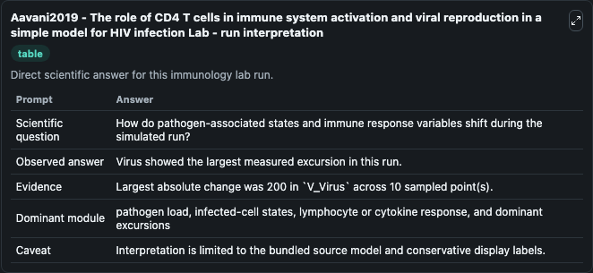
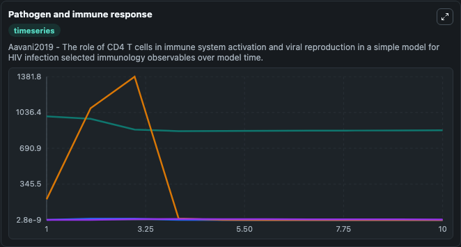
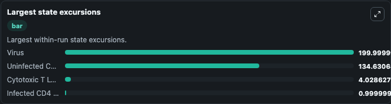

# Aavani2019 - The role of CD4 T cells in immune system activation and viral reproduction in a simple model for HIV infection Lab

Curated immunology lab using the bundled source model as the scientific source of truth.

## What You'll See

This captured run documents the default Aavani2019 - The role of CD4 T cells in immune system activation and viral reproduction in a simple model for HIV infection configuration for 10.0 time units with a 1.0 communication step. Default inputs include Initial Uninfected CD4 T Cells, Initial Infected CD4 T Cells, Initial Virus, and Initial Cytotoxic T Lymphocytes. Reported outputs include uninfected_cd4_t_cells, infected_cd4_t_cells, virus, and cytotoxic_t_lymphocytes. The screenshots below pair the run-interpretation table with Pathogen and immune response and Largest state excursions so the README shows both trajectories and the strongest state changes from the same dark-mode run.

<!-- BIOSIMULANT_VISUALS_START -->
### Output Visualizations

The run-interpretation table summarizes the configured Aavani2019 - The role of CD4 T cells in immune system activation and viral reproduction in a simple model for HIV infection simulation and its final-state diagnostics.

The Pathogen and immune response time series follows the selected immune, pathogen, tumor, or signaling quantities across the simulated horizon.

The largest state excursions chart ranks the state variables that moved furthest during the run.

<!-- BIOSIMULANT_VISUALS_END -->
