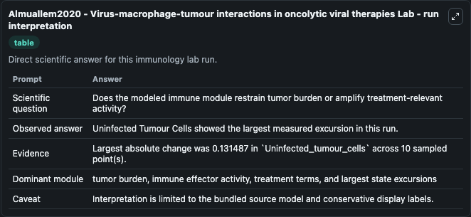
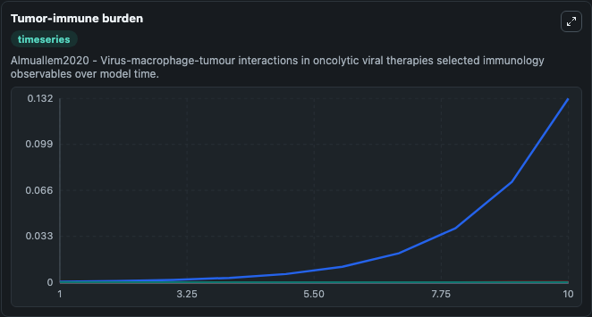
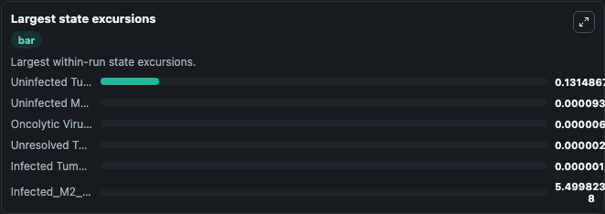

# Almuallem2020 - Virus-macrophage-tumour interactions in oncolytic viral therapies Lab

Curated immunology lab using the bundled source model as the scientific source of truth.

## What You'll See

This captured run documents the default Almuallem2020 - Virus-macrophage-tumour interactions in oncolytic viral therapies configuration for 10.0 time units with a 1.0 communication step. Default inputs include Initial Infected Tumour Cells, Initial Uninfected Tumour Cells, Initial Oncolytic Viruses, and Initial Unresolved Tumor Observable 1. Reported outputs include infected_tumour_cells, uninfected_tumour_cells, oncolytic_viruses, and unresolved_tumor_observable_1. The screenshots below pair the run-interpretation table with Tumor-immune burden and Largest state excursions so the README shows both trajectories and the strongest state changes from the same dark-mode run.

<!-- BIOSIMULANT_VISUALS_START -->
### Output Visualizations

The run-interpretation table summarizes the configured Almuallem2020 - Virus-macrophage-tumour interactions in oncolytic viral therapies simulation and its final-state diagnostics.

The Tumor-immune burden time series follows the selected immune, pathogen, tumor, or signaling quantities across the simulated horizon.

The largest state excursions chart ranks the state variables that moved furthest during the run.

<!-- BIOSIMULANT_VISUALS_END -->
