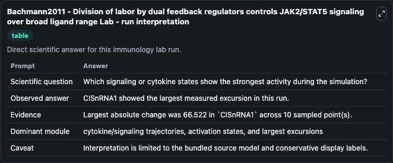
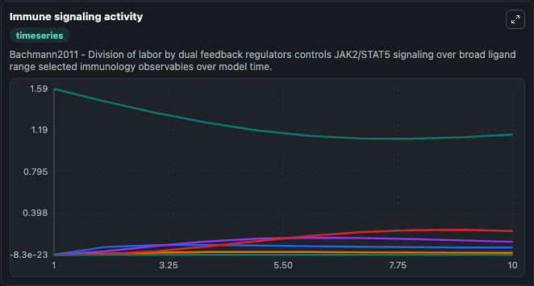
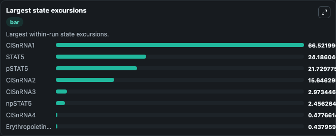

# Bachmann2011 - Division of labor by dual feedback regulators controls JAK2/STAT5 signaling over broad ligand range Lab

Curated immunology lab using the bundled source model as the scientific source of truth.

## What You'll See

This captured run documents the default Bachmann2011 - Division of labor by dual feedback regulators controls JAK2/STAT5 signaling over broad ligand range configuration for 10.0 time units with a 1.0 communication step. Default inputs include Initial Erythropoietin Receptor Jak2 Complex, Initial Phosphorylated Erythropoietin Receptor Jak2 Complex, Initial Phosphorylated Erythropoietin Receptor Jak2 Site 1, and Initial Phosphorylated Erythropoietin Receptor Jak2 Site 2. Reported outputs include erythropoietin_receptor_jak2_complex, phosphorylated_erythropoietin_receptor_jak2_complex, phosphorylated_erythropoietin_receptor_jak2_site_1, and phosphorylated_erythropoietin_receptor_jak2_site_2. The screenshots below pair the run-interpretation table with Immune signaling activity and Largest state excursions so the README shows both trajectories and the strongest state changes from the same dark-mode run.

<!-- BIOSIMULANT_VISUALS_START -->
### Output Visualizations

The run-interpretation table summarizes the configured Bachmann2011 - Division of labor by dual feedback regulators controls JAK2/STAT5 signaling over broad ligand range simulation and its final-state diagnostics.

The Immune signaling activity time series follows the selected immune, pathogen, tumor, or signaling quantities across the simulated horizon.

The largest state excursions chart ranks the state variables that moved furthest during the run.

<!-- BIOSIMULANT_VISUALS_END -->
