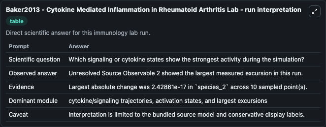
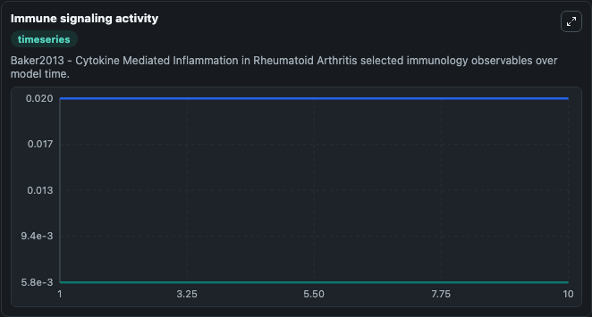
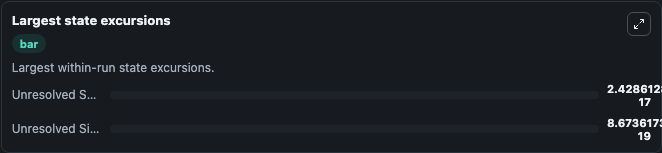

# Baker2013 - Cytokine Mediated Inflammation in Rheumatoid Arthritis Lab

Curated immunology lab using the bundled source model as the scientific source of truth.

## What You'll See

This captured run documents the default Baker2013 - Cytokine Mediated Inflammation in Rheumatoid Arthritis configuration for 10.0 time units with a 1.0 communication step. Reported outputs include unresolved_signaling_observable_1, unresolved_source_observable_2, state, and summary. The screenshots below pair the run-interpretation table with Immune signaling activity and Largest state excursions so the README shows both trajectories and the strongest state changes from the same dark-mode run.

<!-- BIOSIMULANT_VISUALS_START -->
### Output Visualizations

The run-interpretation table summarizes the configured Baker2013 - Cytokine Mediated Inflammation in Rheumatoid Arthritis simulation and its final-state diagnostics.

The Immune signaling activity time series follows the selected immune, pathogen, tumor, or signaling quantities across the simulated horizon.

The largest state excursions chart ranks the state variables that moved furthest during the run.

<!-- BIOSIMULANT_VISUALS_END -->
