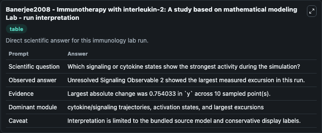
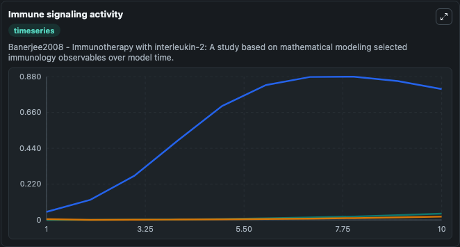
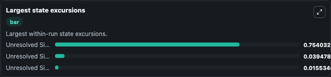

# Banerjee2008 - Immunotherapy with interleukin-2: A study based on mathematical modeling Lab

Curated immunology lab using the bundled source model as the scientific source of truth.

## What You'll See

This captured run documents the default Banerjee2008 - Immunotherapy with interleukin-2: A study based on mathematical modeling configuration for 10.0 time units with a 1.0 communication step. Default inputs include Initial Unresolved Signaling Observable 1, Initial Unresolved Signaling Observable 2, and Initial Unresolved Signaling Observable 3. Reported outputs include unresolved_signaling_observable_1, unresolved_signaling_observable_2, unresolved_signaling_observable_3, and state. The screenshots below pair the run-interpretation table with Immune signaling activity and Largest state excursions so the README shows both trajectories and the strongest state changes from the same dark-mode run.

<!-- BIOSIMULANT_VISUALS_START -->
### Output Visualizations

The run-interpretation table summarizes the configured Banerjee2008 - Immunotherapy with interleukin-2: A study based on mathematical modeling simulation and its final-state diagnostics.

The Immune signaling activity time series follows the selected immune, pathogen, tumor, or signaling quantities across the simulated horizon.

The largest state excursions chart ranks the state variables that moved furthest during the run.

<!-- BIOSIMULANT_VISUALS_END -->
