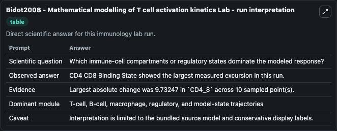
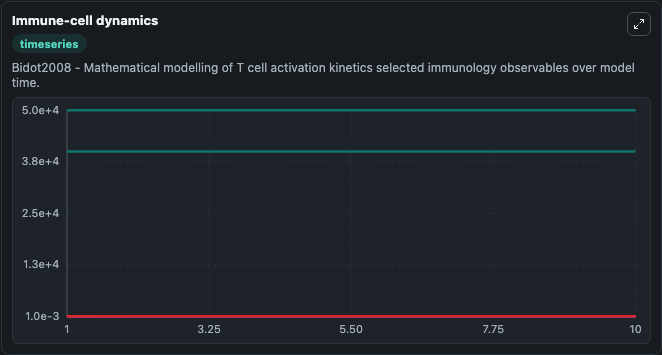
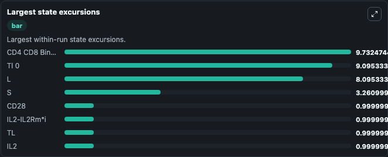

# Bidot2008 - Mathematical modelling of T cell activation kinetics Lab

Curated immunology lab using the bundled source model as the scientific source of truth.

## What You'll See

This captured run documents the default Bidot2008 - Mathematical modelling of T cell activation kinetics configuration for 10.0 time units with a 1.0 communication step. Default inputs include Initial CD4 CD8 Binding State, Initial Cd28 Cd80 Costimulation Complex, Initial Tl 0, and Initial Unresolved Immune Observable 1. Reported outputs include cd4_cd8_binding_state, cd28_cd80_costimulation_complex, tl_0, and unresolved_immune_observable_1. The screenshots below pair the run-interpretation table with Immune-cell dynamics and Largest state excursions so the README shows both trajectories and the strongest state changes from the same dark-mode run.

<!-- BIOSIMULANT_VISUALS_START -->
### Output Visualizations

The run-interpretation table summarizes the configured Bidot2008 - Mathematical modelling of T cell activation kinetics simulation and its final-state diagnostics.

The Immune-cell dynamics time series follows the selected immune, pathogen, tumor, or signaling quantities across the simulated horizon.

The largest state excursions chart ranks the state variables that moved furthest during the run.

<!-- BIOSIMULANT_VISUALS_END -->
