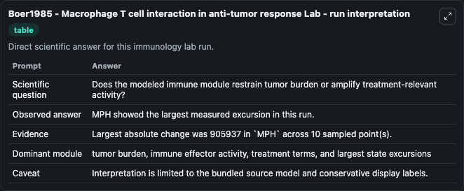
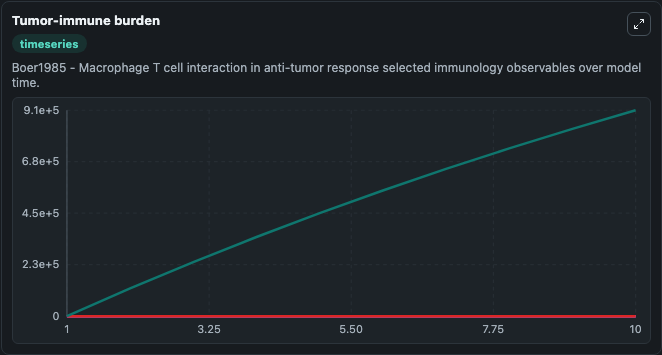
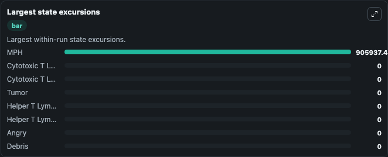

# Boer1985 - Macrophage T cell interaction in anti-tumor response Lab

Curated immunology lab using the bundled source model as the scientific source of truth.

## What You'll See

This captured run documents the default Boer1985 - Macrophage T cell interaction in anti-tumor response configuration for 10.0 time units with a 1.0 communication step. Default inputs include Initial Tumor, Initial Cytotoxic T Lymphocyte Precursors, Initial Cytotoxic T Lymphocytes, and Initial Helper T Lymphocyte Precursors. Reported outputs include tumor, cytotoxic_t_lymphocyte_precursors, cytotoxic_t_lymphocytes, and helper_t_lymphocyte_precursors. The screenshots below pair the run-interpretation table with Tumor-immune burden and Largest state excursions so the README shows both trajectories and the strongest state changes from the same dark-mode run.

<!-- BIOSIMULANT_VISUALS_START -->
### Output Visualizations

The run-interpretation table summarizes the configured Boer1985 - Macrophage T cell interaction in anti-tumor response simulation and its final-state diagnostics.

The Tumor-immune burden time series follows the selected immune, pathogen, tumor, or signaling quantities across the simulated horizon.

The largest state excursions chart ranks the state variables that moved furthest during the run.

<!-- BIOSIMULANT_VISUALS_END -->
