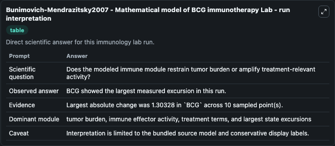
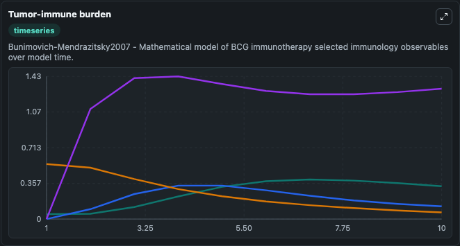
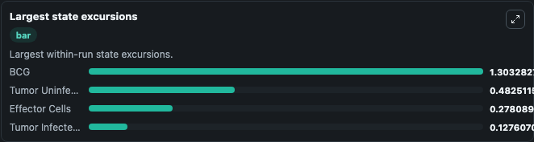

# Bunimovich-Mendrazitsky2007 - Mathematical model of BCG immunotherapy Lab

Curated immunology lab using the bundled source model as the scientific source of truth.

## What You'll See

This captured run documents the default Bunimovich-Mendrazitsky2007 - Mathematical model of BCG immunotherapy configuration for 10.0 time units with a 1.0 communication step. Default inputs include Initial Effector Cells, Initial Tumor Infected Cells, Initial Tumor Uninfected Cells, and Initial BCG. Reported outputs include effector_cells, tumor_infected_cells, tumor_uninfected_cells, and bcg. The screenshots below pair the run-interpretation table with Tumor-immune burden and Largest state excursions so the README shows both trajectories and the strongest state changes from the same dark-mode run.

<!-- BIOSIMULANT_VISUALS_START -->
### Output Visualizations

The run-interpretation table summarizes the configured Bunimovich-Mendrazitsky2007 - Mathematical model of BCG immunotherapy simulation and its final-state diagnostics.

The Tumor-immune burden time series follows the selected immune, pathogen, tumor, or signaling quantities across the simulated horizon.

The largest state excursions chart ranks the state variables that moved furthest during the run.

<!-- BIOSIMULANT_VISUALS_END -->
