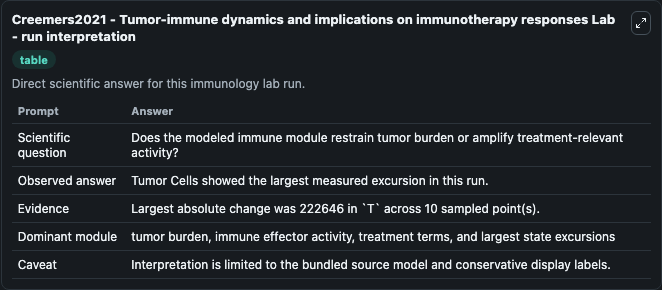
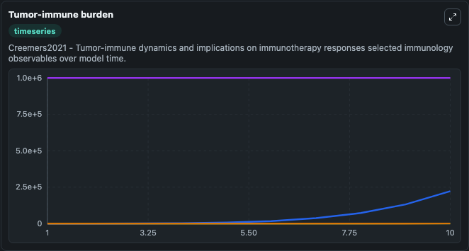
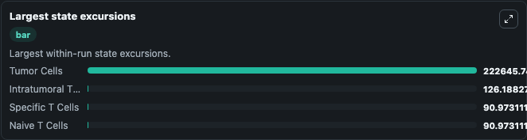

# Creemers2021 - Tumor-immune dynamics and implications on immunotherapy responses Lab

Curated immunology lab using the bundled source model as the scientific source of truth.

## What You'll See

This captured run documents the default Creemers2021 - Tumor-immune dynamics and implications on immunotherapy responses configuration for 10.0 time units with a 1.0 communication step. Default inputs include Initial Intratumoral T Cells, Initial Tumor Cells, Initial Specific T Cells, and Initial Naive T Cells. Reported outputs include intratumoral_t_cells, tumor_cells, specific_t_cells, and naive_t_cells. The screenshots below pair the run-interpretation table with Tumor-immune burden and Largest state excursions so the README shows both trajectories and the strongest state changes from the same dark-mode run.

<!-- BIOSIMULANT_VISUALS_START -->
### Output Visualizations

The run-interpretation table summarizes the configured Creemers2021 - Tumor-immune dynamics and implications on immunotherapy responses simulation and its final-state diagnostics.

The Tumor-immune burden time series follows the selected immune, pathogen, tumor, or signaling quantities across the simulated horizon.

The largest state excursions chart ranks the state variables that moved furthest during the run.

<!-- BIOSIMULANT_VISUALS_END -->
