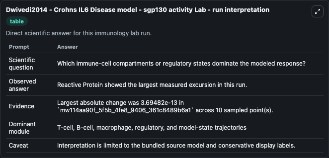
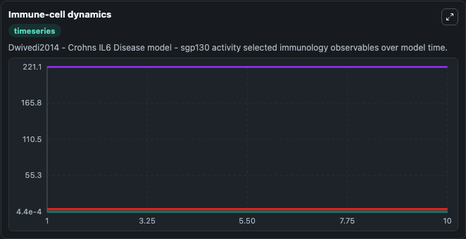
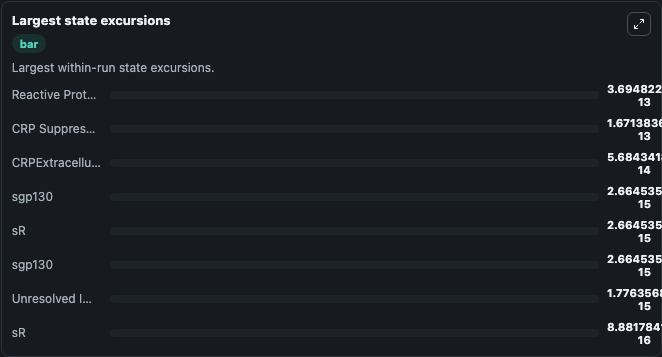

# Dwivedi2014 - Crohns IL6 Disease model - sgp130 activity Lab

Curated immunology lab using the bundled source model as the scientific source of truth.

## What You'll See

This captured run documents the default Dwivedi2014 - Crohns IL6 Disease model - sgp130 activity configuration for 10.0 time units with a 1.0 communication step. Default inputs include Initial Interleukin 6, Initial Unresolved Immune Observable 1, Initial Soluble Interleukin 6 Sgp130 Complex, and Initial Reactive Protein. Reported outputs include interleukin_6, unresolved_immune_observable_1, soluble_interleukin_6_sgp130_complex, and reactive_protein. The screenshots below pair the run-interpretation table with Immune-cell dynamics and Largest state excursions so the README shows both trajectories and the strongest state changes from the same dark-mode run.

<!-- BIOSIMULANT_VISUALS_START -->
### Output Visualizations

The run-interpretation table summarizes the configured Dwivedi2014 - Crohns IL6 Disease model - sgp130 activity simulation and its final-state diagnostics.

The Immune-cell dynamics time series follows the selected immune, pathogen, tumor, or signaling quantities across the simulated horizon.

The largest state excursions chart ranks the state variables that moved furthest during the run.

<!-- BIOSIMULANT_VISUALS_END -->
