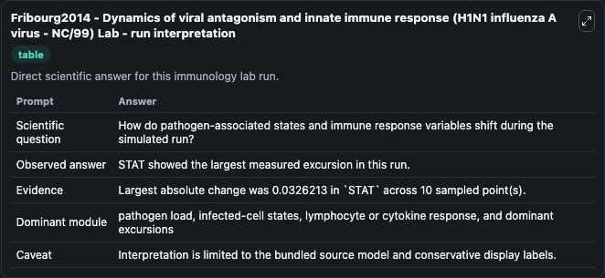
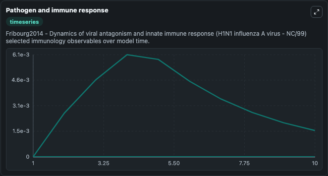
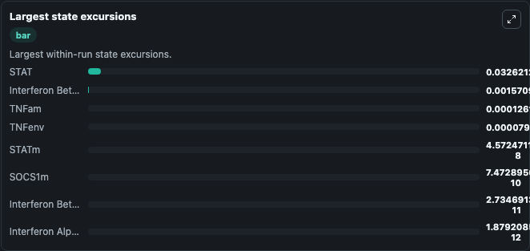

# Fribourg2014 - Dynamics of viral antagonism and innate immune response (H1N1 influenza A virus - NC/99) Lab

Curated immunology lab using the bundled source model as the scientific source of truth.

## What You'll See

This captured run documents the default Fribourg2014 - Dynamics of viral antagonism and innate immune response (H1N1 influenza A virus - NC/99) configuration for 10.0 time units with a 1.0 communication step. Default inputs include Initial Interferon Beta mRNA, Initial Interferon Beta Env, Initial Interferon Alpha mRNA, and Initial Interferon Alpha Env. Reported outputs include interferon_beta_mrna, interferon_beta_env, interferon_alpha_mrna, and interferon_alpha_env. The screenshots below pair the run-interpretation table with Pathogen and immune response and Largest state excursions so the README shows both trajectories and the strongest state changes from the same dark-mode run.

<!-- BIOSIMULANT_VISUALS_START -->
### Output Visualizations

The run-interpretation table summarizes the configured Fribourg2014 - Dynamics of viral antagonism and innate immune response (H1N1 influenza A virus - NC/99) simulation and its final-state diagnostics.

The Pathogen and immune response time series follows the selected immune, pathogen, tumor, or signaling quantities across the simulated horizon.

The largest state excursions chart ranks the state variables that moved furthest during the run.

<!-- BIOSIMULANT_VISUALS_END -->
