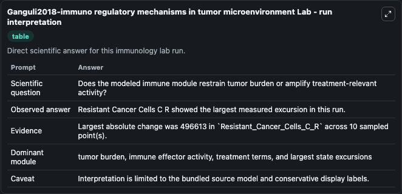
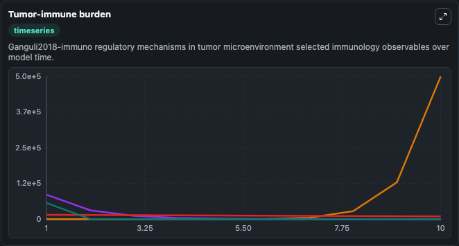
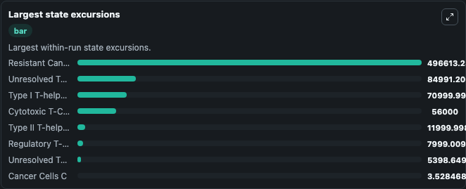

# Ganguli2018-immuno regulatory mechanisms in tumor microenvironment Lab

Curated immunology lab using the bundled source model as the scientific source of truth.

## What You'll See

This captured run documents the default Ganguli2018-immuno regulatory mechanisms in tumor microenvironment configuration for 10.0 time units with a 1.0 communication step. Default inputs include Initial Cancer Stem Cells S, Initial Cancer Cells C, Initial Resistant Cancer Cells C R, and Initial Unresolved Tumor Observable 1. Reported outputs include cancer_stem_cells_s, cancer_cells_c, resistant_cancer_cells_c_r, and unresolved_tumor_observable_1. The screenshots below pair the run-interpretation table with Tumor-immune burden and Largest state excursions so the README shows both trajectories and the strongest state changes from the same dark-mode run.

<!-- BIOSIMULANT_VISUALS_START -->
### Output Visualizations

The run-interpretation table summarizes the configured Ganguli2018-immuno regulatory mechanisms in tumor microenvironment simulation and its final-state diagnostics.

The Tumor-immune burden time series follows the selected immune, pathogen, tumor, or signaling quantities across the simulated horizon.

The largest state excursions chart ranks the state variables that moved furthest during the run.

<!-- BIOSIMULANT_VISUALS_END -->
