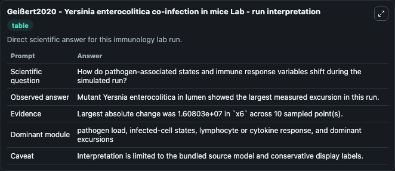
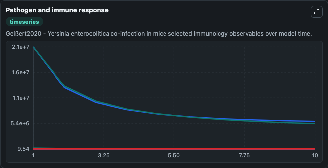
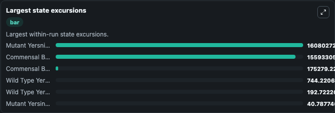

# Geißert2020 - Yersinia enterocolitica co-infection in mice Lab

Curated immunology lab using the bundled source model as the scientific source of truth.

## What You'll See

This captured run documents the default Geißert2020 - Yersinia enterocolitica co-infection in mice configuration for 10.0 time units with a 1.0 communication step. Default inputs include Initial Wild Type Yersinia Enterocolitica In Mucosa and Initial Wild Type Yersinia Enterocolitica In Lumen. Reported outputs include commensal_bacteria_in_mucosa, commensal_bacteria_in_lumen, wild_type_yersinia_enterocolitica_in_mucosa, and mutant_yersinia_enterocolitica_in_mucosa. The screenshots below pair the run-interpretation table with Pathogen and immune response and Largest state excursions so the README shows both trajectories and the strongest state changes from the same dark-mode run.

<!-- BIOSIMULANT_VISUALS_START -->
### Output Visualizations

The run-interpretation table summarizes the configured Geißert2020 - Yersinia enterocolitica co-infection in mice simulation and its final-state diagnostics.

The Pathogen and immune response time series follows the selected immune, pathogen, tumor, or signaling quantities across the simulated horizon.

The largest state excursions chart ranks the state variables that moved furthest during the run.

<!-- BIOSIMULANT_VISUALS_END -->
