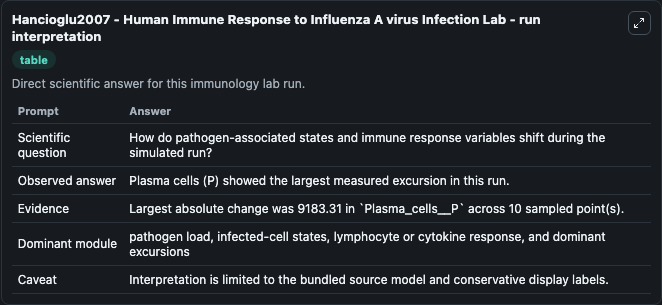
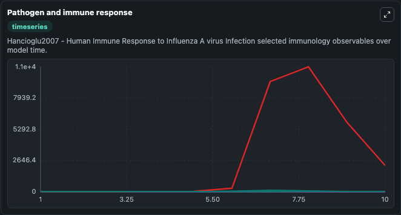
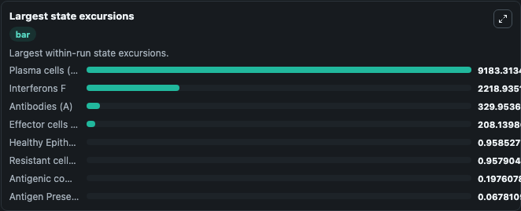

# Hancioglu2007 - Human Immune Response to Influenza A virus Infection Lab

Curated immunology lab using the bundled source model as the scientific source of truth.

## What You'll See

This captured run documents the default Hancioglu2007 - Human Immune Response to Influenza A virus Infection configuration for 10.0 time units with a 1.0 communication step. Default inputs include Initial Viral Load V, Initial Infected Epithelial Cells I, Initial Healthy Epithelial Cells H, and Initial Antigen Presenting Cell Cells M. Reported outputs include viral_load_v, infected_epithelial_cells_i, healthy_epithelial_cells_h, and antigen_presenting_cell_cells_m. The screenshots below pair the run-interpretation table with Pathogen and immune response and Largest state excursions so the README shows both trajectories and the strongest state changes from the same dark-mode run.

<!-- BIOSIMULANT_VISUALS_START -->
### Output Visualizations

The run-interpretation table summarizes the configured Hancioglu2007 - Human Immune Response to Influenza A virus Infection simulation and its final-state diagnostics.

The Pathogen and immune response time series follows the selected immune, pathogen, tumor, or signaling quantities across the simulated horizon.

The largest state excursions chart ranks the state variables that moved furthest during the run.

<!-- BIOSIMULANT_VISUALS_END -->
