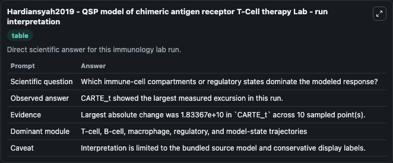
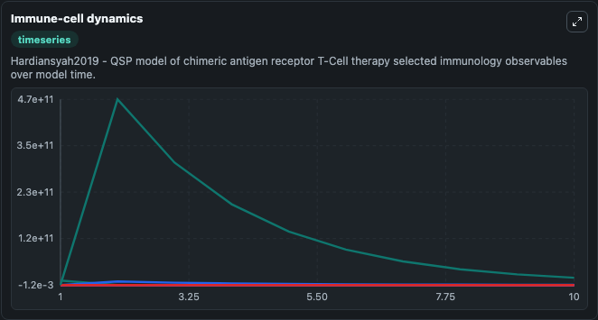
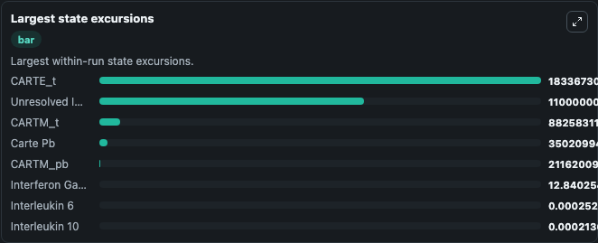

# Hardiansyah2019 - QSP model of chimeric antigen receptor T-Cell therapy Lab

Curated immunology lab using the bundled source model as the scientific source of truth.

## What You'll See

This captured run documents the default Hardiansyah2019 - QSP model of chimeric antigen receptor T-Cell therapy configuration for 10.0 time units with a 1.0 communication step. Default inputs include Initial Unresolved Immune Observable 1, Initial Carte Pb, Initial Interleukin 6, and Initial Interleukin 10. Reported outputs include unresolved_immune_observable_1, carte_pb, interleukin_6, and interleukin_10. The screenshots below pair the run-interpretation table with Immune-cell dynamics and Largest state excursions so the README shows both trajectories and the strongest state changes from the same dark-mode run.

<!-- BIOSIMULANT_VISUALS_START -->
### Output Visualizations

The run-interpretation table summarizes the configured Hardiansyah2019 - QSP model of chimeric antigen receptor T-Cell therapy simulation and its final-state diagnostics.

The Immune-cell dynamics time series follows the selected immune, pathogen, tumor, or signaling quantities across the simulated horizon.

The largest state excursions chart ranks the state variables that moved furthest during the run.

<!-- BIOSIMULANT_VISUALS_END -->
