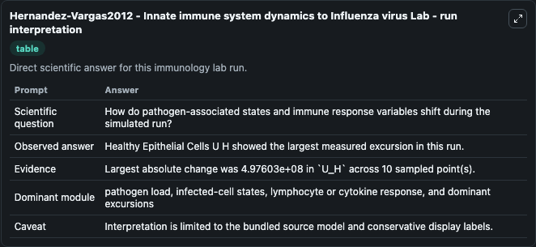
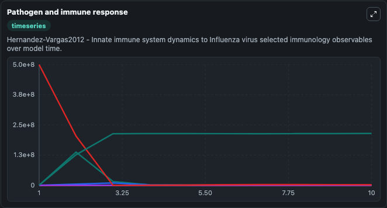
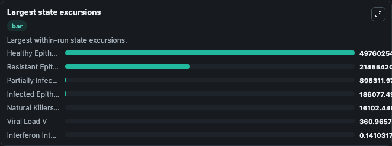

# Hernandez-Vargas2012 - Innate immune system dynamics to Influenza virus Lab

Curated immunology lab using the bundled source model as the scientific source of truth.

## What You'll See

This captured run documents the default Hernandez-Vargas2012 - Innate immune system dynamics to Influenza virus configuration for 10.0 time units with a 1.0 communication step. Default inputs include Initial Partially Infected Epithelial Cells U E, Initial Infected Epithelial Cells U I, Initial Viral Load V, and Initial Interferon Interferon. Reported outputs include partially_infected_epithelial_cells_u_e, infected_epithelial_cells_u_i, viral_load_v, and interferon_interferon. The screenshots below pair the run-interpretation table with Pathogen and immune response and Largest state excursions so the README shows both trajectories and the strongest state changes from the same dark-mode run.

<!-- BIOSIMULANT_VISUALS_START -->
### Output Visualizations

The run-interpretation table summarizes the configured Hernandez-Vargas2012 - Innate immune system dynamics to Influenza virus simulation and its final-state diagnostics.

The Pathogen and immune response time series follows the selected immune, pathogen, tumor, or signaling quantities across the simulated horizon.

The largest state excursions chart ranks the state variables that moved furthest during the run.

<!-- BIOSIMULANT_VISUALS_END -->
