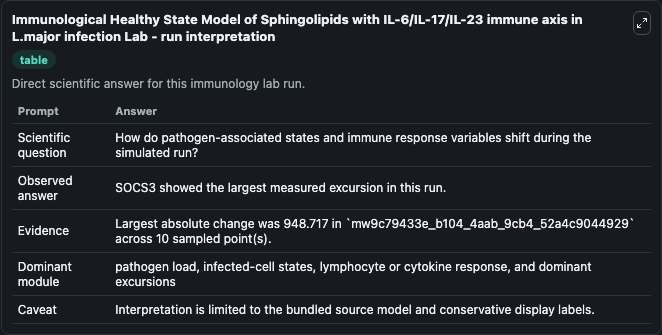
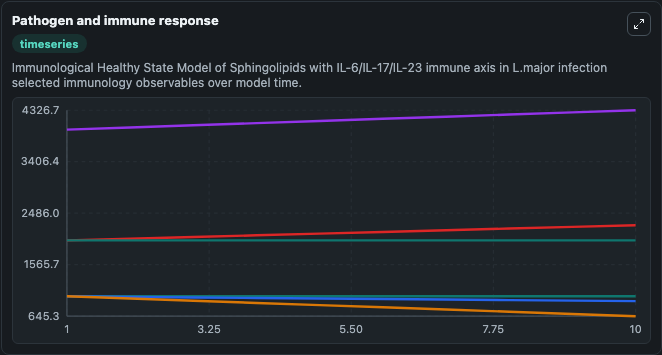
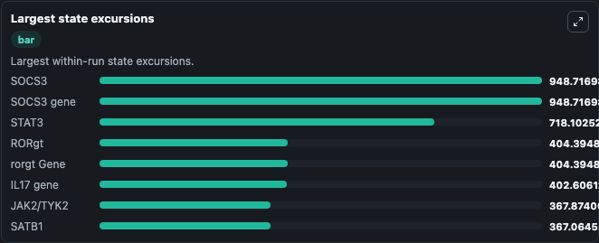

# Immunological Healthy State Model of Sphingolipids with IL-6/IL-17/IL-23 immune axis in L.major infection Lab

Curated immunology lab using the bundled source model as the scientific source of truth.

## What You'll See

This captured run documents the default Immunological Healthy State Model of Sphingolipids with IL-6/IL-17/IL-23 immune axis in L.major infection configuration for 10.0 time units with a 1.0 communication step. Default inputs include Initial Lpg Toll Like Receptor Complex, Initial Unresolved Infection Observable 2, and Initial Irak1 Irak4 Complex. Reported outputs include unresolved_infection_observable_1, toll_like_receptor, lpg_toll_like_receptor_complex, and unresolved_infection_observable_2. The screenshots below pair the run-interpretation table with Pathogen and immune response and Largest state excursions so the README shows both trajectories and the strongest state changes from the same dark-mode run.

<!-- BIOSIMULANT_VISUALS_START -->
### Output Visualizations

The run-interpretation table summarizes the configured Immunological Healthy State Model of Sphingolipids with IL-6/IL-17/IL-23 immune axis in L.major infection simulation and its final-state diagnostics.

The Pathogen and immune response time series follows the selected immune, pathogen, tumor, or signaling quantities across the simulated horizon.

The largest state excursions chart ranks the state variables that moved furthest during the run.

<!-- BIOSIMULANT_VISUALS_END -->
