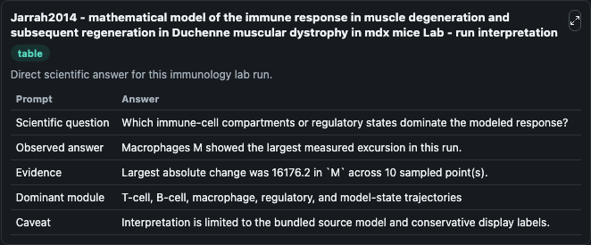
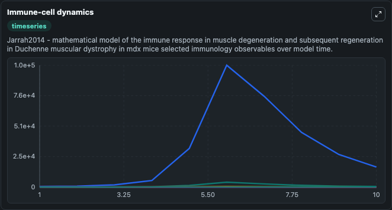
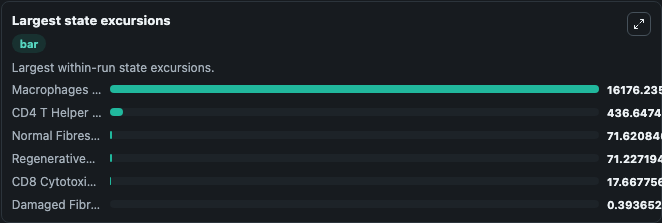

# Jarrah2014 - mathematical model of the immune response in muscle degeneration and subsequent regeneration in Duchenne muscular dystrophy in mdx mice Lab

Curated immunology lab using the bundled source model as the scientific source of truth.

## What You'll See

This captured run documents the default Jarrah2014 - mathematical model of the immune response in muscle degeneration and subsequent regeneration in Duchenne muscular dystrophy in mdx mice configuration for 10.0 time units with a 1.0 communication step. Default inputs include Initial CD4 T Helper Cells H, Initial Macrophages M, Initial CD8 Cytotoxic T Lymphocytes C, and Initial Damaged Fibres D. Reported outputs include cd4_t_helper_cells_h, macrophages_m, cd8_cytotoxic_t_lymphocytes_c, and damaged_fibres_d. The screenshots below pair the run-interpretation table with Immune-cell dynamics and Largest state excursions so the README shows both trajectories and the strongest state changes from the same dark-mode run.

<!-- BIOSIMULANT_VISUALS_START -->
### Output Visualizations

The run-interpretation table summarizes the configured Jarrah2014 - mathematical model of the immune response in muscle degeneration and subsequent regeneration in Duchenne muscular dystrophy in mdx mice simulation and its final-state diagnostics.

The Immune-cell dynamics time series follows the selected immune, pathogen, tumor, or signaling quantities across the simulated horizon.

The largest state excursions chart ranks the state variables that moved furthest during the run.

<!-- BIOSIMULANT_VISUALS_END -->
