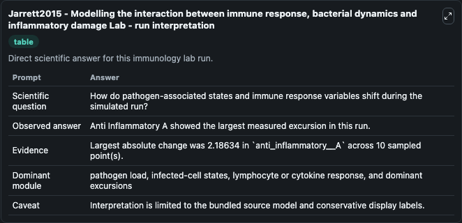
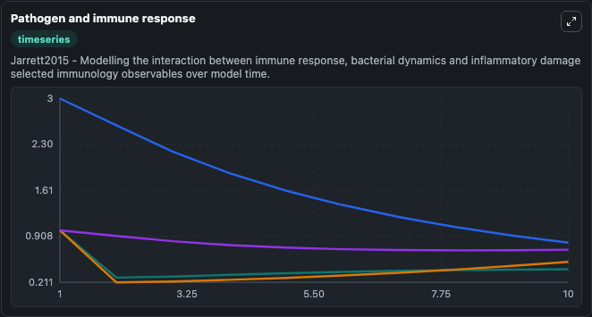
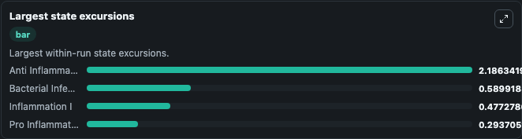

# Jarrett2015 - Modelling the interaction between immune response, bacterial dynamics and inflammatory damage Lab

Curated immunology lab using the bundled source model as the scientific source of truth.

## What You'll See

This captured run documents the default Jarrett2015 - Modelling the interaction between immune response, bacterial dynamics and inflammatory damage configuration for 10.0 time units with a 1.0 communication step. Default inputs include Initial Bacterial Infection B, Initial Anti Inflammatory A, Initial Inflammation I, and Initial Pro Inflammatory P. Reported outputs include bacterial_infection_b, anti_inflammatory_a, inflammation_i, and pro_inflammatory_p. The screenshots below pair the run-interpretation table with Pathogen and immune response and Largest state excursions so the README shows both trajectories and the strongest state changes from the same dark-mode run.

<!-- BIOSIMULANT_VISUALS_START -->
### Output Visualizations

The run-interpretation table summarizes the configured Jarrett2015 - Modelling the interaction between immune response, bacterial dynamics and inflammatory damage simulation and its final-state diagnostics.

The Pathogen and immune response time series follows the selected immune, pathogen, tumor, or signaling quantities across the simulated horizon.

The largest state excursions chart ranks the state variables that moved furthest during the run.

<!-- BIOSIMULANT_VISUALS_END -->
