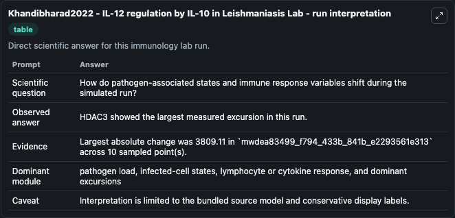
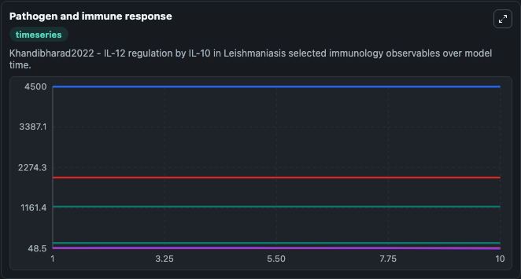
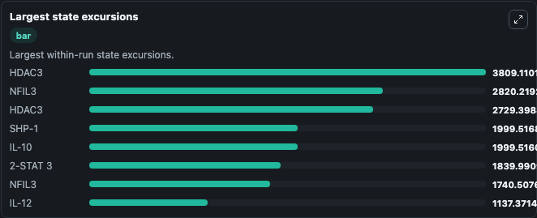

# Khandibharad2022 - IL-12 regulation by IL-10 in Leishmaniasis Lab

Curated immunology lab using the bundled source model as the scientific source of truth.

## What You'll See

This captured run documents the default Khandibharad2022 - IL-12 regulation by IL-10 in Leishmaniasis configuration for 10.0 time units with a 1.0 communication step. Default inputs include Initial Uev1a Signaling Component, Initial Interferon Gamma, and Initial Interferon G. Reported outputs include uev1a_signaling_component, ikb_p65_p50_complex, interferon_gamma, and interferon_g. The screenshots below pair the run-interpretation table with Pathogen and immune response and Largest state excursions so the README shows both trajectories and the strongest state changes from the same dark-mode run.

<!-- BIOSIMULANT_VISUALS_START -->
### Output Visualizations

The run-interpretation table summarizes the configured Khandibharad2022 - IL-12 regulation by IL-10 in Leishmaniasis simulation and its final-state diagnostics.

The Pathogen and immune response time series follows the selected immune, pathogen, tumor, or signaling quantities across the simulated horizon.

The largest state excursions chart ranks the state variables that moved furthest during the run.

<!-- BIOSIMULANT_VISUALS_END -->
