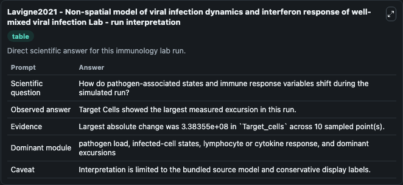
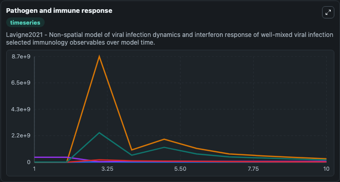
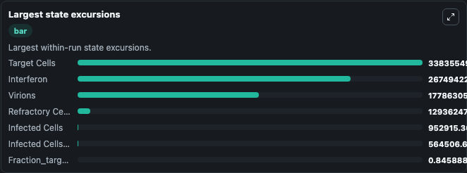

# Lavigne2021 - Non-spatial model of viral infection dynamics and interferon response of well-mixed viral infection Lab

Curated immunology lab using the bundled source model as the scientific source of truth.

## What You'll See

This captured run documents the default Lavigne2021 - Non-spatial model of viral infection dynamics and interferon response of well-mixed viral infection configuration for 10.0 time units with a 1.0 communication step. Default inputs include Initial Infected Cells Antiviral, Initial Infected Cells, Initial Interferon, and Initial Target Cells. Reported outputs include infected_cells_antiviral, infected_cells, interferon, and target_cells. The screenshots below pair the run-interpretation table with Pathogen and immune response and Largest state excursions so the README shows both trajectories and the strongest state changes from the same dark-mode run.

<!-- BIOSIMULANT_VISUALS_START -->
### Output Visualizations

The run-interpretation table summarizes the configured Lavigne2021 - Non-spatial model of viral infection dynamics and interferon response of well-mixed viral infection simulation and its final-state diagnostics.

The Pathogen and immune response time series follows the selected immune, pathogen, tumor, or signaling quantities across the simulated horizon.

The largest state excursions chart ranks the state variables that moved furthest during the run.

<!-- BIOSIMULANT_VISUALS_END -->
