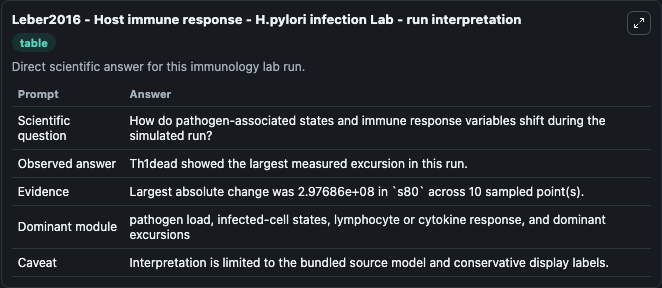
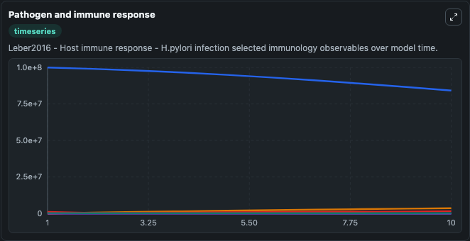
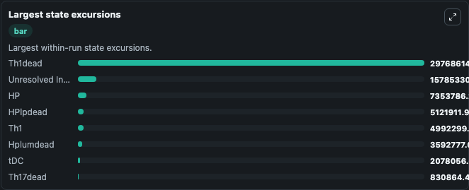

# Leber2016 - Host immune response - H.pylori infection Lab

Curated immunology lab using the bundled source model as the scientific source of truth.

## What You'll See

This captured run documents the default Leber2016 - Host immune response - H.pylori infection configuration for 10.0 time units with a 1.0 communication step. Default inputs include Initial Interferon Gamma, Initial Unresolved Infection Observable 1, Initial Hplumdead, and Initial Tolb Signaling Component. Reported outputs include interferon_gamma, unresolved_infection_observable_1, hplumdead, and tolb_signaling_component. The screenshots below pair the run-interpretation table with Pathogen and immune response and Largest state excursions so the README shows both trajectories and the strongest state changes from the same dark-mode run.

<!-- BIOSIMULANT_VISUALS_START -->
### Output Visualizations

The run-interpretation table summarizes the configured Leber2016 - Host immune response - H.pylori infection simulation and its final-state diagnostics.

The Pathogen and immune response time series follows the selected immune, pathogen, tumor, or signaling quantities across the simulated horizon.

The largest state excursions chart ranks the state variables that moved furthest during the run.

<!-- BIOSIMULANT_VISUALS_END -->
