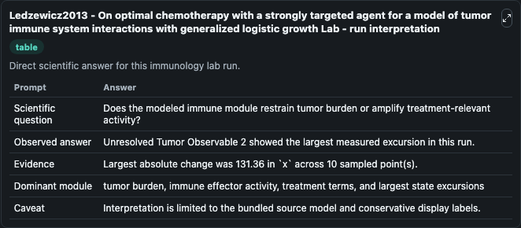
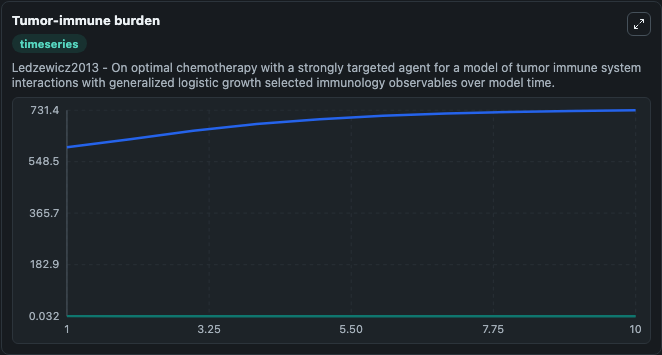
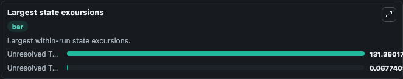

# Ledzewicz2013 - On optimal chemotherapy with a strongly targeted agent for a model of tumor immune system interactions with generalized logistic growth Lab

Curated immunology lab using the bundled source model as the scientific source of truth.

## What You'll See

This captured run documents the default Ledzewicz2013 - On optimal chemotherapy with a strongly targeted agent for a model of tumor immune system interactions with generalized logistic growth configuration for 10.0 time units with a 1.0 communication step. Default inputs include Initial Unresolved Tumor Observable 1, Initial Unresolved Tumor Observable 2, A Constant Rate Of Influx Of T Cells Generated Through The Primary Organs, and Natural Death Of T Cells Rate. Reported outputs include unresolved_tumor_observable_1, unresolved_tumor_observable_2, state, and summary. The screenshots below pair the run-interpretation table with Tumor-immune burden and Largest state excursions so the README shows both trajectories and the strongest state changes from the same dark-mode run.

<!-- BIOSIMULANT_VISUALS_START -->
### Output Visualizations

The run-interpretation table summarizes the configured Ledzewicz2013 - On optimal chemotherapy with a strongly targeted agent for a model of tumor immune system interactions with generalized logistic growth simulation and its final-state diagnostics.

The Tumor-immune burden time series follows the selected immune, pathogen, tumor, or signaling quantities across the simulated horizon.

The largest state excursions chart ranks the state variables that moved furthest during the run.

<!-- BIOSIMULANT_VISUALS_END -->
