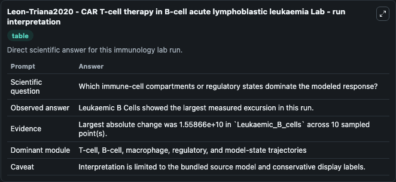
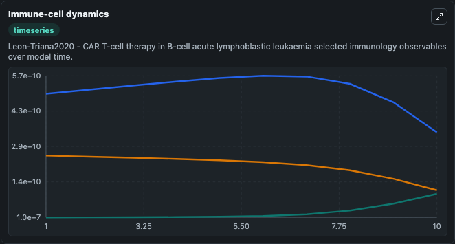
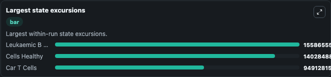

# Leon-Triana2020 - CAR T-cell therapy in B-cell acute lymphoblastic leukaemia Lab

Curated immunology lab using the bundled source model as the scientific source of truth.

## What You'll See

This captured run documents the default Leon-Triana2020 - CAR T-cell therapy in B-cell acute lymphoblastic leukaemia configuration for 10.0 time units with a 1.0 communication step. Default inputs include Initial Car T Cells, Initial Leukaemic B Cells, and Initial Cells Healthy. Reported outputs include car_t_cells, leukaemic_b_cells, cells_healthy, and state. The screenshots below pair the run-interpretation table with Immune-cell dynamics and Largest state excursions so the README shows both trajectories and the strongest state changes from the same dark-mode run.

<!-- BIOSIMULANT_VISUALS_START -->
### Output Visualizations

The run-interpretation table summarizes the configured Leon-Triana2020 - CAR T-cell therapy in B-cell acute lymphoblastic leukaemia simulation and its final-state diagnostics.

The Immune-cell dynamics time series follows the selected immune, pathogen, tumor, or signaling quantities across the simulated horizon.

The largest state excursions chart ranks the state variables that moved furthest during the run.

<!-- BIOSIMULANT_VISUALS_END -->
