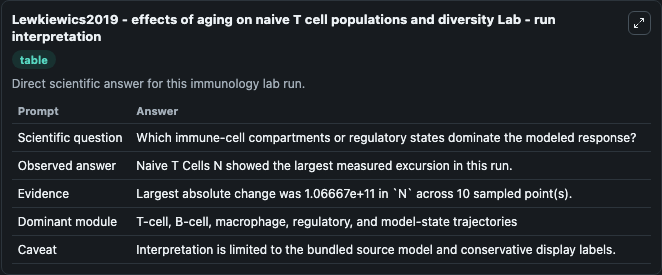
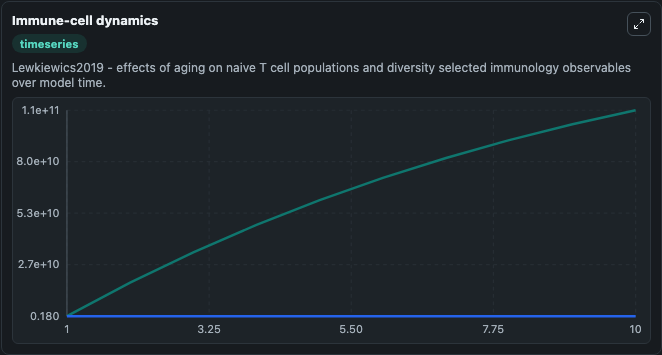
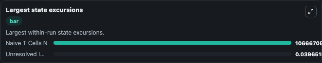

# Lewkiewics2019 - effects of aging on naive T cell populations and diversity Lab

Curated immunology lab using the bundled source model as the scientific source of truth.

## What You'll See

This captured run documents the default Lewkiewics2019 - effects of aging on naive T cell populations and diversity configuration for 10.0 time units with a 1.0 communication step. Default inputs include Initial Naive T Cells N. Reported outputs include naive_t_cells_n, unresolved_immune_observable_1, state, and summary. The screenshots below pair the run-interpretation table with Immune-cell dynamics and Largest state excursions so the README shows both trajectories and the strongest state changes from the same dark-mode run.

<!-- BIOSIMULANT_VISUALS_START -->
### Output Visualizations

The run-interpretation table summarizes the configured Lewkiewics2019 - effects of aging on naive T cell populations and diversity simulation and its final-state diagnostics.

The Immune-cell dynamics time series follows the selected immune, pathogen, tumor, or signaling quantities across the simulated horizon.

The largest state excursions chart ranks the state variables that moved furthest during the run.

<!-- BIOSIMULANT_VISUALS_END -->
