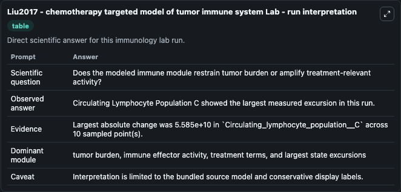
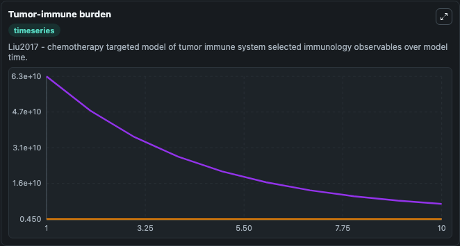
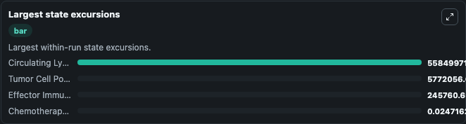

# Liu2017 - chemotherapy targeted model of tumor immune system Lab

Curated immunology lab using the bundled source model as the scientific source of truth.

## What You'll See

This captured run documents the default Liu2017 - chemotherapy targeted model of tumor immune system configuration for 10.0 time units with a 1.0 communication step. Default inputs include Initial Effector Immune Cell Population N, Initial Tumor Cell Population T, Initial Chemotherapeutic Drug Concentration M, and Initial Circulating Lymphocyte Population C. Reported outputs include effector_immune_cell_population_n, tumor_cell_population_t, chemotherapeutic_drug_concentration_m, and circulating_lymphocyte_population_c. The screenshots below pair the run-interpretation table with Tumor-immune burden and Largest state excursions so the README shows both trajectories and the strongest state changes from the same dark-mode run.

<!-- BIOSIMULANT_VISUALS_START -->
### Output Visualizations

The run-interpretation table summarizes the configured Liu2017 - chemotherapy targeted model of tumor immune system simulation and its final-state diagnostics.

The Tumor-immune burden time series follows the selected immune, pathogen, tumor, or signaling quantities across the simulated horizon.

The largest state excursions chart ranks the state variables that moved furthest during the run.

<!-- BIOSIMULANT_VISUALS_END -->
