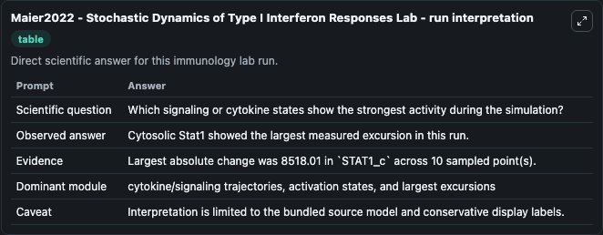
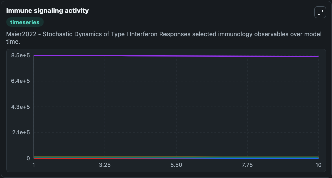
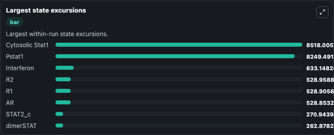

# Maier2022 - Stochastic Dynamics of Type I Interferon Responses Lab

Curated immunology lab using the bundled source model as the scientific source of truth.

## What You'll See

This captured run documents the default Maier2022 - Stochastic Dynamics of Type I Interferon Responses configuration for 10.0 time units with a 1.0 communication step. Default inputs include Initial Cytosolic Stat2 Irf9 Complex, Initial Nuclear Stat2 Irf9 Complex, Initial Interferon, and Initial Cytosolic Stat1. Reported outputs include cytosolic_stat2_irf9_complex, nuclear_stat2_irf9_complex, interferon, and cytosolic_stat1. The screenshots below pair the run-interpretation table with Immune signaling activity and Largest state excursions so the README shows both trajectories and the strongest state changes from the same dark-mode run.

<!-- BIOSIMULANT_VISUALS_START -->
### Output Visualizations

The run-interpretation table summarizes the configured Maier2022 - Stochastic Dynamics of Type I Interferon Responses simulation and its final-state diagnostics.

The Immune signaling activity time series follows the selected immune, pathogen, tumor, or signaling quantities across the simulated horizon.

The largest state excursions chart ranks the state variables that moved furthest during the run.

<!-- BIOSIMULANT_VISUALS_END -->
