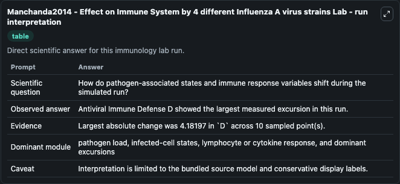
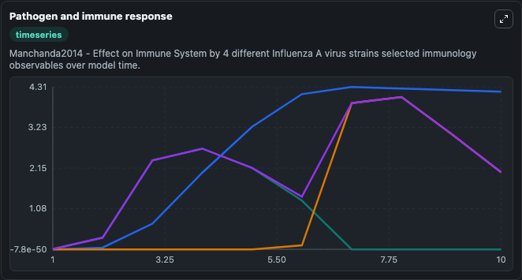
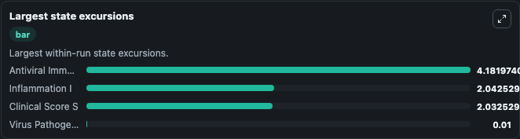

# Manchanda2014 - Effect on Immune System by 4 different Influenza A virus strains Lab

Curated immunology lab using the bundled source model as the scientific source of truth.

## What You'll See

This captured run documents the default Manchanda2014 - Effect on Immune System by 4 different Influenza A virus strains configuration for 10.0 time units with a 1.0 communication step. Default inputs include Initial Virus Pathogenicity P, Initial Antiviral Immune Defense D, Initial Inflammation I, and Infection Of Virus Rate. Reported outputs include virus_pathogenicity_p, antiviral_immune_defense_d, inflammation_i, and clinical_score_s. The screenshots below pair the run-interpretation table with Pathogen and immune response and Largest state excursions so the README shows both trajectories and the strongest state changes from the same dark-mode run.

<!-- BIOSIMULANT_VISUALS_START -->
### Output Visualizations

The run-interpretation table summarizes the configured Manchanda2014 - Effect on Immune System by 4 different Influenza A virus strains simulation and its final-state diagnostics.

The Pathogen and immune response time series follows the selected immune, pathogen, tumor, or signaling quantities across the simulated horizon.

The largest state excursions chart ranks the state variables that moved furthest during the run.

<!-- BIOSIMULANT_VISUALS_END -->
