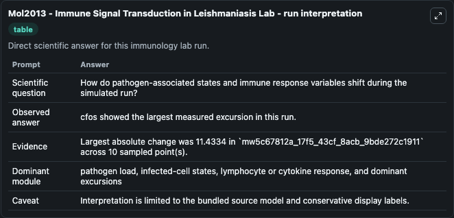
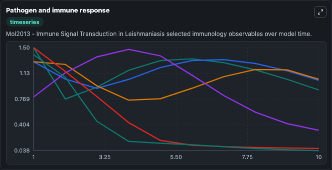
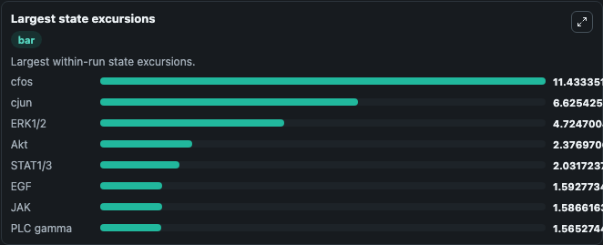

# Mol2013 - Immune Signal Transduction in Leishmaniasis Lab

Curated immunology lab using the bundled source model as the scientific source of truth.

## What You'll See

This captured run documents the default Mol2013 - Immune Signal Transduction in Leishmaniasis configuration for 10.0 time units with a 1.0 communication step. Default inputs include Initial Tumor Necrosis Factor, Initial Tnf Receptor 1, Initial Tradd Traf2 Rip Complex, and Initial Unresolved Infection Observable 1. Reported outputs include tumor_necrosis_factor, tnf_receptor_1, tradd_traf2_rip_complex, and unresolved_infection_observable_1. The screenshots below pair the run-interpretation table with Pathogen and immune response and Largest state excursions so the README shows both trajectories and the strongest state changes from the same dark-mode run.

<!-- BIOSIMULANT_VISUALS_START -->
### Output Visualizations

The run-interpretation table summarizes the configured Mol2013 - Immune Signal Transduction in Leishmaniasis simulation and its final-state diagnostics.

The Pathogen and immune response time series follows the selected immune, pathogen, tumor, or signaling quantities across the simulated horizon.

The largest state excursions chart ranks the state variables that moved furthest during the run.

<!-- BIOSIMULANT_VISUALS_END -->
