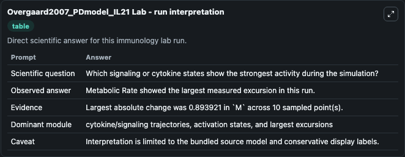
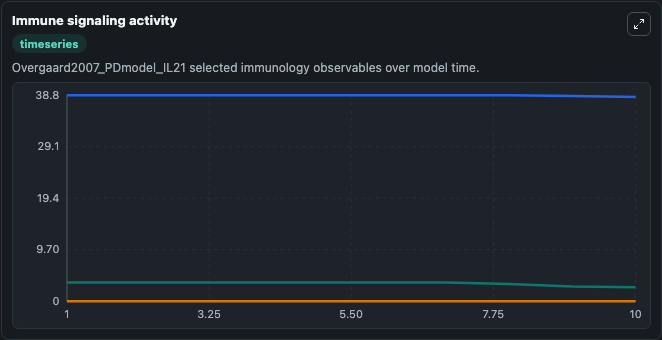
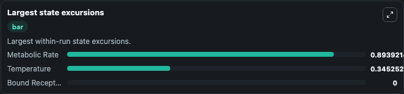

# Overgaard2007 PDmodel IL21 Lab

Curated immunology lab using the bundled source model as the scientific source of truth.

## What You'll See

This captured run documents the default Overgaard2007 PDmodel IL21 configuration for 10.0 time units with a 1.0 communication step. Default inputs include Rate Constant Metabolism Parameter, Amt Dose, and Delta High Dose. Reported outputs include metabolic_rate, temperature, bound_receptor, and state. The screenshots below pair the run-interpretation table with Immune signaling activity and Largest state excursions so the README shows both trajectories and the strongest state changes from the same dark-mode run.

<!-- BIOSIMULANT_VISUALS_START -->
### Output Visualizations

The run-interpretation table summarizes the configured Overgaard2007 PDmodel IL21 simulation and its final-state diagnostics.

The Immune signaling activity time series follows the selected immune, pathogen, tumor, or signaling quantities across the simulated horizon.

The largest state excursions chart ranks the state variables that moved furthest during the run.

<!-- BIOSIMULANT_VISUALS_END -->
