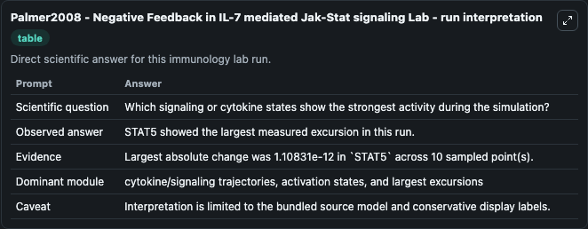
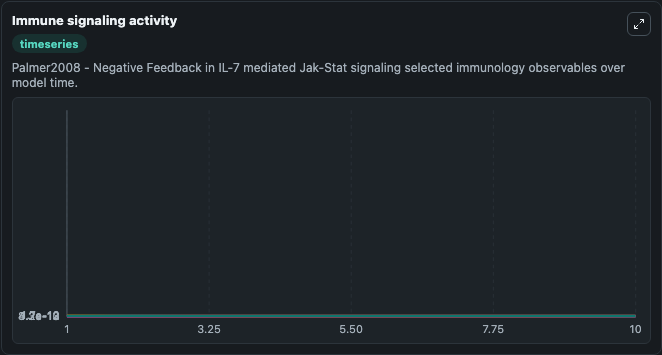
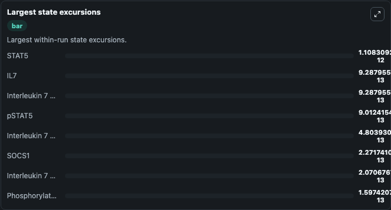

# Palmer2008 - Negative Feedback in IL-7 mediated Jak-Stat signaling Lab

Curated immunology lab using the bundled source model as the scientific source of truth.

## What You'll See

This captured run documents the default Palmer2008 - Negative Feedback in IL-7 mediated Jak-Stat signaling configuration for 10.0 time units with a 1.0 communication step. Default inputs include Initial Interleukin 7 Receptor Jak1 Stat5 Complex, Initial Interleukin 7 Receptor Jak1 Complex, Initial Interleukin 7 Receptor Jak1, and Initial Phosphorylated Interleukin 7 Receptor Jak1 Complex. Reported outputs include interleukin_7_receptor_jak1_stat5_complex, interleukin_7_receptor_jak1_complex, interleukin_7_receptor_jak1, and phosphorylated_interleukin_7_receptor_jak1_complex. The screenshots below pair the run-interpretation table with Immune signaling activity and Largest state excursions so the README shows both trajectories and the strongest state changes from the same dark-mode run.

<!-- BIOSIMULANT_VISUALS_START -->
### Output Visualizations

The run-interpretation table summarizes the configured Palmer2008 - Negative Feedback in IL-7 mediated Jak-Stat signaling simulation and its final-state diagnostics.

The Immune signaling activity time series follows the selected immune, pathogen, tumor, or signaling quantities across the simulated horizon.

The largest state excursions chart ranks the state variables that moved furthest during the run.

<!-- BIOSIMULANT_VISUALS_END -->
