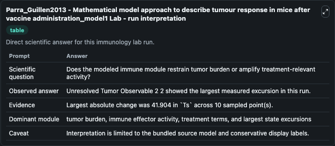
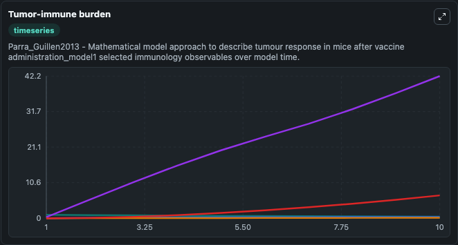
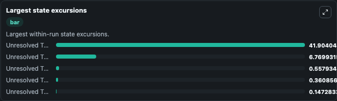

# Parra Guillen2013 - Mathematical model approach to describe tumour response in mice after vaccine administration model1 Lab

Curated immunology lab using the bundled source model as the scientific source of truth.

## What You'll See

This captured run documents the default Parra Guillen2013 - Mathematical model approach to describe tumour response in mice after vaccine administration model1 configuration for 10.0 time units with a 1.0 communication step. Default inputs include Initial Unresolved Tumor Observable 1, Initial Unresolved Tumor Observable 1 2, Initial Unresolved Tumor Observable 2, and Initial Unresolved Tumor Observable 2 2. Reported outputs include unresolved_tumor_observable_1, unresolved_tumor_observable_1_2, unresolved_tumor_observable_2, and unresolved_tumor_observable_2_2. The screenshots below pair the run-interpretation table with Tumor-immune burden and Largest state excursions so the README shows both trajectories and the strongest state changes from the same dark-mode run.

<!-- BIOSIMULANT_VISUALS_START -->
### Output Visualizations

The run-interpretation table summarizes the configured Parra Guillen2013 - Mathematical model approach to describe tumour response in mice after vaccine administration model1 simulation and its final-state diagnostics.

The Tumor-immune burden time series follows the selected immune, pathogen, tumor, or signaling quantities across the simulated horizon.

The largest state excursions chart ranks the state variables that moved furthest during the run.

<!-- BIOSIMULANT_VISUALS_END -->
