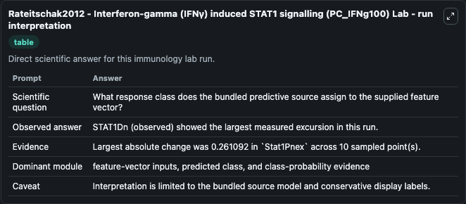
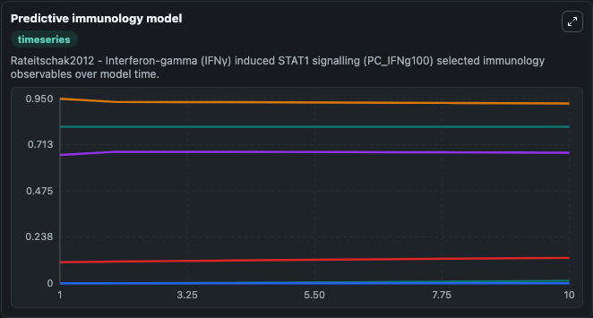
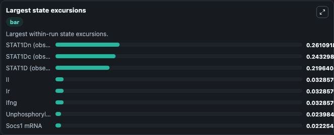

# Rateitschak2012 - Interferon-gamma (IFNγ) induced STAT1 signalling (PC IFNg100) Lab

Curated immunology lab using the bundled source model as the scientific source of truth.

## What You'll See

This captured run documents the default Rateitschak2012 - Interferon-gamma (IFNγ) induced STAT1 signalling (PC IFNg100) configuration for 10.0 time units with a 1.0 communication step. Reported outputs include phosphorylated_stat1_dimer, nuclear_phosphorylated_stat1_dimer, unphosphorylated_stat1, and nuclear_unphosphorylated_stat1. The screenshots below pair the run-interpretation table with Predictive immunology model and Largest state excursions so the README shows both trajectories and the strongest state changes from the same dark-mode run.

<!-- BIOSIMULANT_VISUALS_START -->
### Output Visualizations

The run-interpretation table summarizes the configured Rateitschak2012 - Interferon-gamma (IFNγ) induced STAT1 signalling (PC IFNg100) simulation and its final-state diagnostics.

The Predictive immunology model time series follows the selected immune, pathogen, tumor, or signaling quantities across the simulated horizon.

The largest state excursions chart ranks the state variables that moved furthest during the run.

<!-- BIOSIMULANT_VISUALS_END -->
