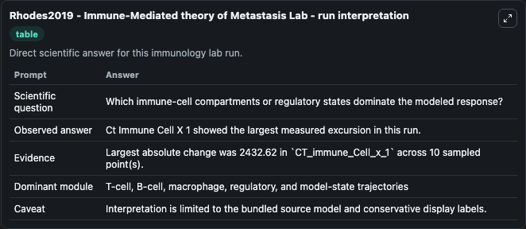
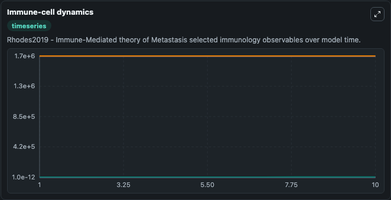
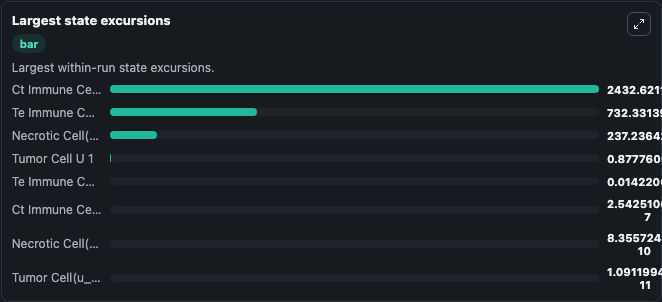

# Rhodes2019 - Immune-Mediated theory of Metastasis Lab

Curated immunology lab using the bundled source model as the scientific source of truth.

## What You'll See

This captured run documents the default Rhodes2019 - Immune-Mediated theory of Metastasis configuration for 10.0 time units with a 1.0 communication step. Default inputs include Initial Te Immune Cell Y 1, Initial Ct Immune Cell X 1, Initial Ct Immune Cell X 2, and Initial Te Immune Cell Y 2. Reported outputs include te_immune_cell_y_1, ct_immune_cell_x_1, ct_immune_cell_x_2, and te_immune_cell_y_2. The screenshots below pair the run-interpretation table with Immune-cell dynamics and Largest state excursions so the README shows both trajectories and the strongest state changes from the same dark-mode run.

<!-- BIOSIMULANT_VISUALS_START -->
### Output Visualizations

The run-interpretation table summarizes the configured Rhodes2019 - Immune-Mediated theory of Metastasis simulation and its final-state diagnostics.

The Immune-cell dynamics time series follows the selected immune, pathogen, tumor, or signaling quantities across the simulated horizon.

The largest state excursions chart ranks the state variables that moved furthest during the run.

<!-- BIOSIMULANT_VISUALS_END -->
