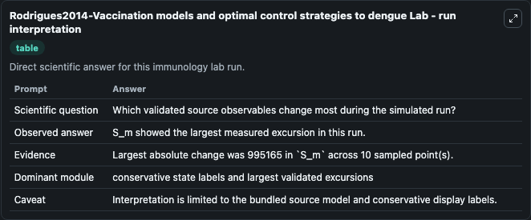
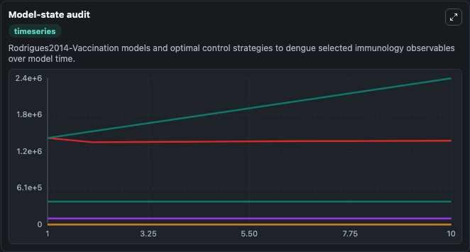
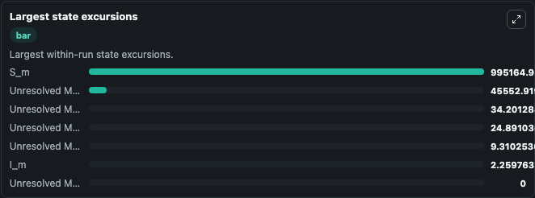

# Rodrigues2014-Vaccination models and optimal control strategies to dengue Lab

Curated immunology lab using the bundled source model as the scientific source of truth.

## What You'll See

This captured run documents the default Rodrigues2014-Vaccination models and optimal control strategies to dengue configuration for 10.0 time units with a 1.0 communication step. Reported outputs include unresolved_model_observable_1, unresolved_model_observable_2, unresolved_model_observable_3, and unresolved_model_observable_4. The screenshots below pair the run-interpretation table with Model-state audit and Largest state excursions so the README shows both trajectories and the strongest state changes from the same dark-mode run.

<!-- BIOSIMULANT_VISUALS_START -->
### Output Visualizations

The run-interpretation table summarizes the configured Rodrigues2014-Vaccination models and optimal control strategies to dengue simulation and its final-state diagnostics.

The Model-state audit time series follows the selected immune, pathogen, tumor, or signaling quantities across the simulated horizon.

The largest state excursions chart ranks the state variables that moved furthest during the run.

<!-- BIOSIMULANT_VISUALS_END -->
