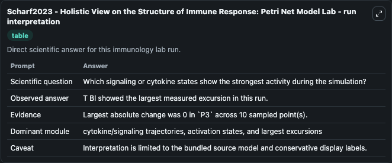
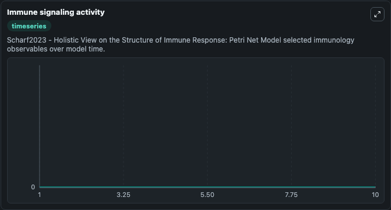
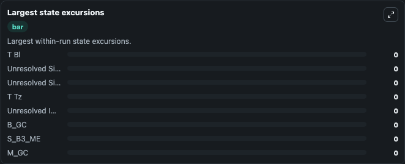

# Scharf2023 - Holistic View on the Structure of Immune Response: Petri Net Model Lab

Curated immunology lab using the bundled source model as the scientific source of truth.

## What You'll See

This captured run documents the default Scharf2023 - Holistic View on the Structure of Immune Response: Petri Net Model configuration for 10.0 time units with a 1.0 communication step. Default inputs include Initial T Bl, Initial Unresolved Signaling Observable 1, Initial Unresolved Signaling Observable 2, and Initial T Tz. Reported outputs include t_bl, unresolved_signaling_observable_1, unresolved_signaling_observable_2, and t_tz. The screenshots below pair the run-interpretation table with Immune signaling activity and Largest state excursions so the README shows both trajectories and the strongest state changes from the same dark-mode run.

<!-- BIOSIMULANT_VISUALS_START -->
### Output Visualizations

The run-interpretation table summarizes the configured Scharf2023 - Holistic View on the Structure of Immune Response: Petri Net Model simulation and its final-state diagnostics.

The Immune signaling activity time series follows the selected immune, pathogen, tumor, or signaling quantities across the simulated horizon.

The largest state excursions chart ranks the state variables that moved furthest during the run.

<!-- BIOSIMULANT_VISUALS_END -->
