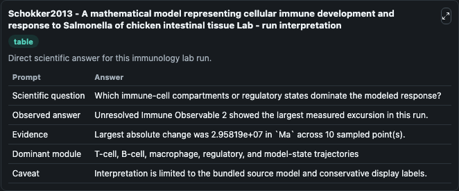
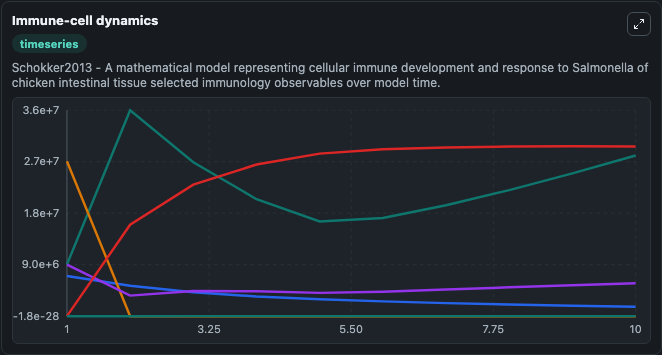
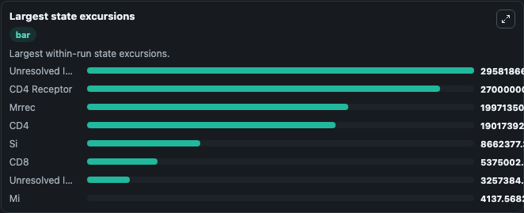

# Schokker2013 - A mathematical model representing cellular immune development and response to Salmonella of chicken intestinal tissue Lab

Curated immunology lab using the bundled source model as the scientific source of truth.

## What You'll See

This captured run documents the default Schokker2013 - A mathematical model representing cellular immune development and response to Salmonella of chicken intestinal tissue configuration for 10.0 time units with a 1.0 communication step. Default inputs include Initial CD4, Initial CD8, Initial CD4 Receptor, and Initial Unresolved Immune Observable 1. Reported outputs include cd4, cd8, cd4_receptor, and unresolved_immune_observable_1. The screenshots below pair the run-interpretation table with Immune-cell dynamics and Largest state excursions so the README shows both trajectories and the strongest state changes from the same dark-mode run.

<!-- BIOSIMULANT_VISUALS_START -->
### Output Visualizations

The run-interpretation table summarizes the configured Schokker2013 - A mathematical model representing cellular immune development and response to Salmonella of chicken intestinal tissue simulation and its final-state diagnostics.

The Immune-cell dynamics time series follows the selected immune, pathogen, tumor, or signaling quantities across the simulated horizon.

The largest state excursions chart ranks the state variables that moved furthest during the run.

<!-- BIOSIMULANT_VISUALS_END -->
