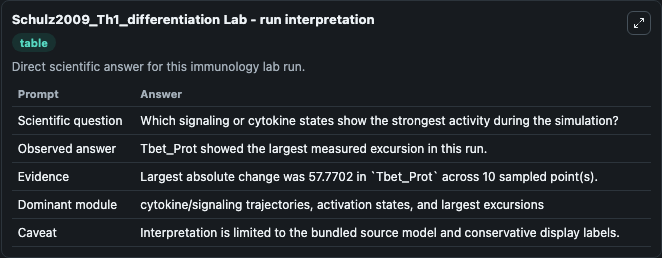
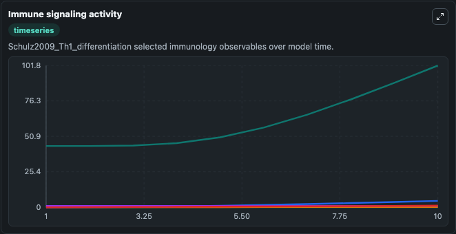
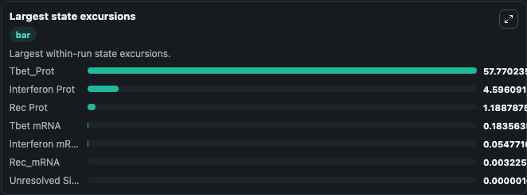

# Schulz2009 Th1 differentiation Lab

Curated immunology lab using the bundled source model as the scientific source of truth.

## What You'll See

This captured run documents the default Schulz2009 Th1 differentiation configuration for 10.0 time units with a 1.0 communication step. Default inputs include Initial Interferon mRNA, Initial Interferon Prot, Initial Tbet mRNA, and Initial Rec Prot. Reported outputs include interferon_mrna, interferon_prot, tbet_mrna, and unresolved_signaling_observable_1. The screenshots below pair the run-interpretation table with Immune signaling activity and Largest state excursions so the README shows both trajectories and the strongest state changes from the same dark-mode run.

<!-- BIOSIMULANT_VISUALS_START -->
### Output Visualizations

The run-interpretation table summarizes the configured Schulz2009 Th1 differentiation simulation and its final-state diagnostics.

The Immune signaling activity time series follows the selected immune, pathogen, tumor, or signaling quantities across the simulated horizon.

The largest state excursions chart ranks the state variables that moved furthest during the run.

<!-- BIOSIMULANT_VISUALS_END -->
