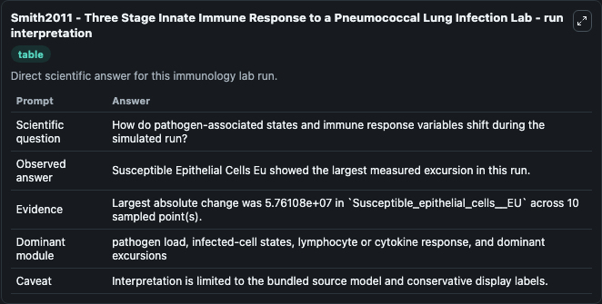
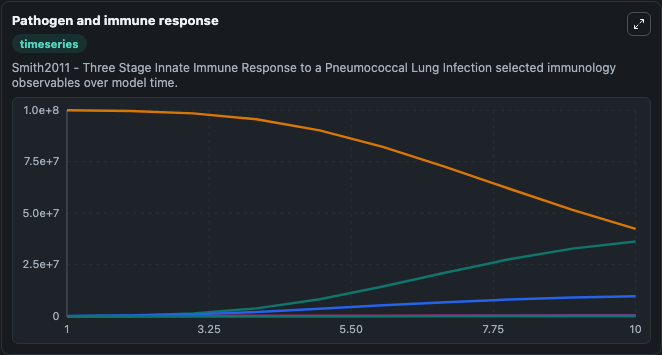
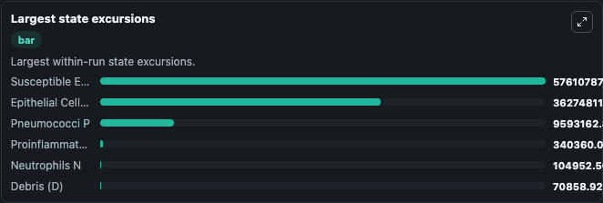

# Smith2011 - Three Stage Innate Immune Response to a Pneumococcal Lung Infection Lab

Curated immunology lab using the bundled source model as the scientific source of truth.

## What You'll See

This captured run documents the default Smith2011 - Three Stage Innate Immune Response to a Pneumococcal Lung Infection configuration for 10.0 time units with a 1.0 communication step. Default inputs include Initial Epithelial Cells With Bacteria Attached Ea, Initial Pneumococci P, Initial Susceptible Epithelial Cells Eu, and Initial Proinflammatory Cytokine C. Reported outputs include epithelial_cells_with_bacteria_attached_ea, pneumococci_p, susceptible_epithelial_cells_eu, and proinflammatory_cytokine_c. The screenshots below pair the run-interpretation table with Pathogen and immune response and Largest state excursions so the README shows both trajectories and the strongest state changes from the same dark-mode run.

<!-- BIOSIMULANT_VISUALS_START -->
### Output Visualizations

The run-interpretation table summarizes the configured Smith2011 - Three Stage Innate Immune Response to a Pneumococcal Lung Infection simulation and its final-state diagnostics.

The Pathogen and immune response time series follows the selected immune, pathogen, tumor, or signaling quantities across the simulated horizon.

The largest state excursions chart ranks the state variables that moved furthest during the run.

<!-- BIOSIMULANT_VISUALS_END -->
