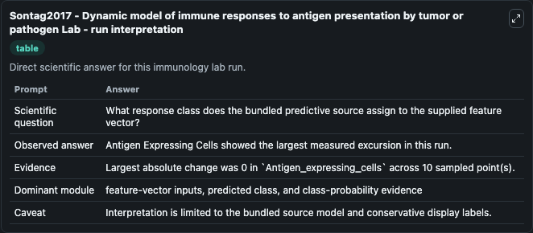
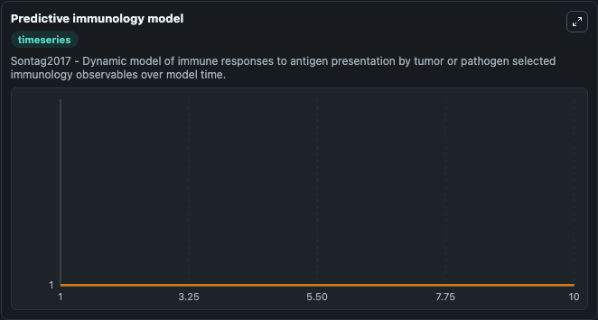
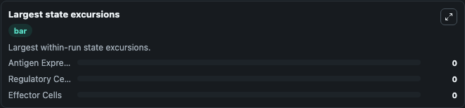

# Sontag2017 - Dynamic model of immune responses to antigen presentation by tumor or pathogen Lab

Curated immunology lab using the bundled source model as the scientific source of truth.

## What You'll See

This captured run documents the default Sontag2017 - Dynamic model of immune responses to antigen presentation by tumor or pathogen configuration for 10.0 time units with a 1.0 communication step. Default inputs include Initial Regulatory Cells and Initial Effector Cells. Reported outputs include antigen_expressing_cells, regulatory_cells, effector_cells, and state. The screenshots below pair the run-interpretation table with Predictive immunology model and Largest state excursions so the README shows both trajectories and the strongest state changes from the same dark-mode run.

<!-- BIOSIMULANT_VISUALS_START -->
### Output Visualizations

The run-interpretation table summarizes the configured Sontag2017 - Dynamic model of immune responses to antigen presentation by tumor or pathogen simulation and its final-state diagnostics.

The Predictive immunology model time series follows the selected immune, pathogen, tumor, or signaling quantities across the simulated horizon.

The largest state excursions chart ranks the state variables that moved furthest during the run.

<!-- BIOSIMULANT_VISUALS_END -->
