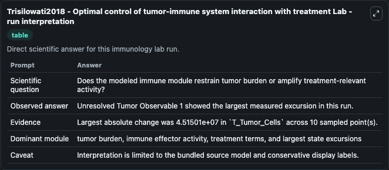
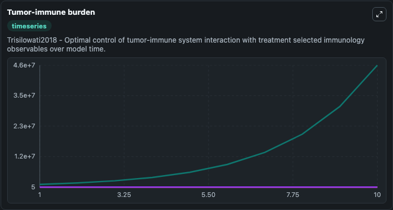
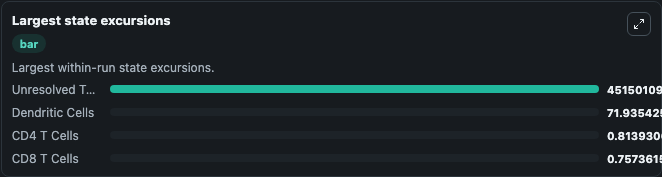

# Trisilowati2018 - Optimal control of tumor-immune system interaction with treatment Lab

Curated immunology lab using the bundled source model as the scientific source of truth.

## What You'll See

This captured run documents the default Trisilowati2018 - Optimal control of tumor-immune system interaction with treatment configuration for 10.0 time units with a 1.0 communication step. Default inputs include Initial Unresolved Tumor Observable 1, Initial CD8 T Cells, Initial CD4 T Cells, and Initial Dendritic Cells. Reported outputs include unresolved_tumor_observable_1, cd8_t_cells, cd4_t_cells, and dendritic_cells. The screenshots below pair the run-interpretation table with Tumor-immune burden and Largest state excursions so the README shows both trajectories and the strongest state changes from the same dark-mode run.

<!-- BIOSIMULANT_VISUALS_START -->
### Output Visualizations

The run-interpretation table summarizes the configured Trisilowati2018 - Optimal control of tumor-immune system interaction with treatment simulation and its final-state diagnostics.

The Tumor-immune burden time series follows the selected immune, pathogen, tumor, or signaling quantities across the simulated horizon.

The largest state excursions chart ranks the state variables that moved furthest during the run.

<!-- BIOSIMULANT_VISUALS_END -->
