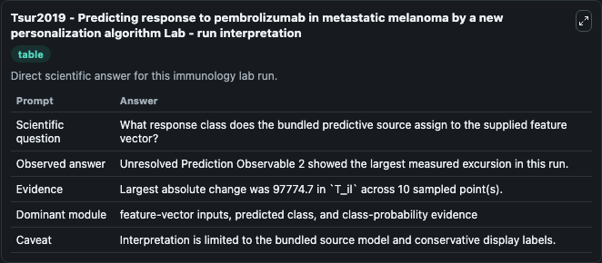
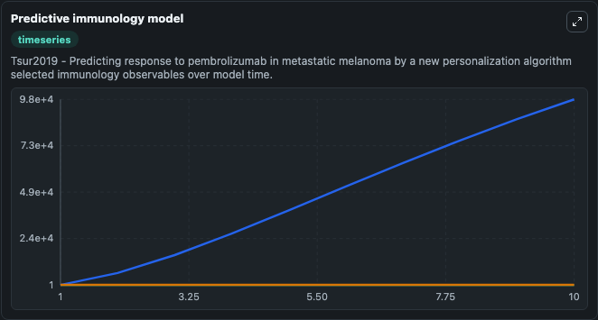
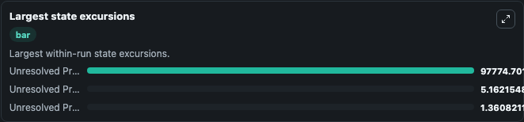

# Tsur2019 - Predicting response to pembrolizumab in metastatic melanoma by a new personalization algorithm Lab

Curated immunology lab using the bundled source model as the scientific source of truth.

## What You'll See

This captured run documents the default Tsur2019 - Predicting response to pembrolizumab in metastatic melanoma by a new personalization algorithm configuration for 10.0 time units with a 1.0 communication step. Default inputs include Initial Unresolved Prediction Observable 1, Initial Unresolved Prediction Observable 2, and Initial Unresolved Prediction Observable 3. Reported outputs include unresolved_prediction_observable_1, unresolved_prediction_observable_2, unresolved_prediction_observable_3, and state. The screenshots below pair the run-interpretation table with Predictive immunology model and Largest state excursions so the README shows both trajectories and the strongest state changes from the same dark-mode run.

<!-- BIOSIMULANT_VISUALS_START -->
### Output Visualizations

The run-interpretation table summarizes the configured Tsur2019 - Predicting response to pembrolizumab in metastatic melanoma by a new personalization algorithm simulation and its final-state diagnostics.

The Predictive immunology model time series follows the selected immune, pathogen, tumor, or signaling quantities across the simulated horizon.

The largest state excursions chart ranks the state variables that moved furthest during the run.

<!-- BIOSIMULANT_VISUALS_END -->
