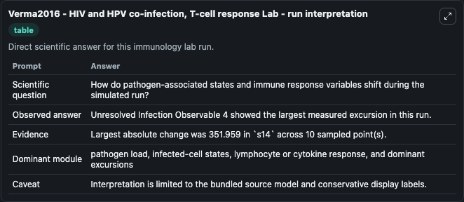
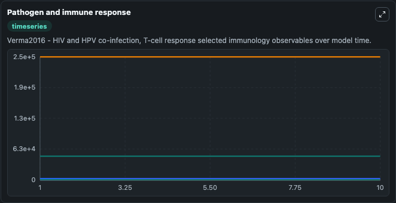
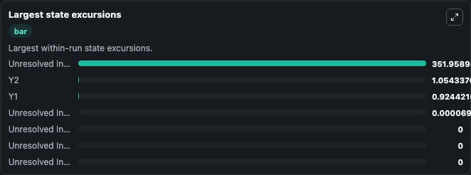

# Verma2016 - HIV and HPV co-infection, T-cell response Lab

Curated immunology lab using the bundled source model as the scientific source of truth.

## What You'll See

This captured run documents the default Verma2016 - HIV and HPV co-infection, T-cell response configuration for 10.0 time units with a 1.0 communication step. Default inputs include Initial Unresolved Infection Observable 1, Initial Unresolved Infection Observable 2, Initial Unresolved Infection Observable 3, and Initial Unresolved Infection Observable 4. Reported outputs include unresolved_infection_observable_1, unresolved_infection_observable_2, unresolved_infection_observable_3, and unresolved_infection_observable_4. The screenshots below pair the run-interpretation table with Pathogen and immune response and Largest state excursions so the README shows both trajectories and the strongest state changes from the same dark-mode run.

<!-- BIOSIMULANT_VISUALS_START -->
### Output Visualizations

The run-interpretation table summarizes the configured Verma2016 - HIV and HPV co-infection, T-cell response simulation and its final-state diagnostics.

The Pathogen and immune response time series follows the selected immune, pathogen, tumor, or signaling quantities across the simulated horizon.

The largest state excursions chart ranks the state variables that moved furthest during the run.

<!-- BIOSIMULANT_VISUALS_END -->
