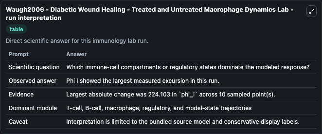
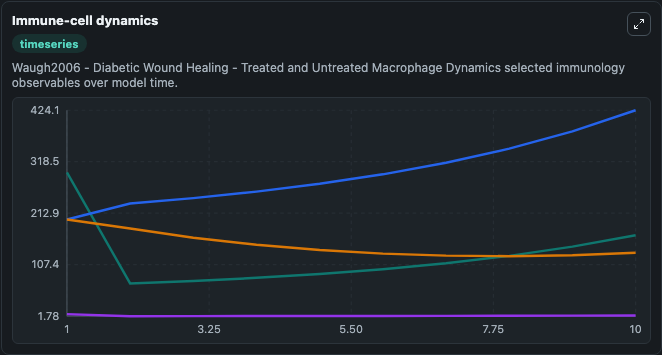
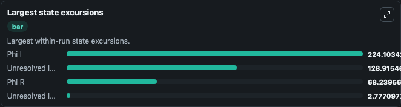

# Waugh2006 - Diabetic Wound Healing - Treated and Untreated Macrophage Dynamics Lab

Curated immunology lab using the bundled source model as the scientific source of truth.

## What You'll See

This captured run documents the default Waugh2006 - Diabetic Wound Healing - Treated and Untreated Macrophage Dynamics configuration for 10.0 time units with a 1.0 communication step. Reported outputs include unresolved_immune_observable_1, phi_i, phi_r, and unresolved_immune_observable_2. The screenshots below pair the run-interpretation table with Immune-cell dynamics and Largest state excursions so the README shows both trajectories and the strongest state changes from the same dark-mode run.

<!-- BIOSIMULANT_VISUALS_START -->
### Output Visualizations

The run-interpretation table summarizes the configured Waugh2006 - Diabetic Wound Healing - Treated and Untreated Macrophage Dynamics simulation and its final-state diagnostics.

The Immune-cell dynamics time series follows the selected immune, pathogen, tumor, or signaling quantities across the simulated horizon.

The largest state excursions chart ranks the state variables that moved furthest during the run.

<!-- BIOSIMULANT_VISUALS_END -->
