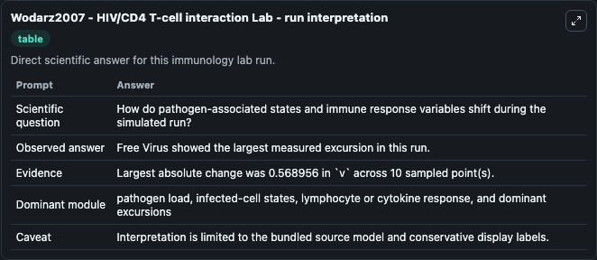
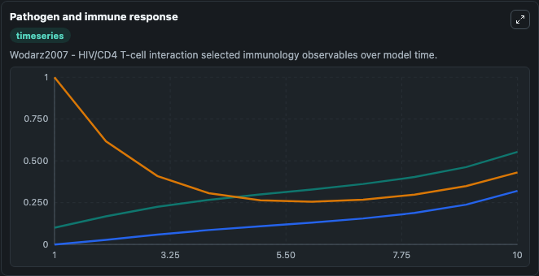
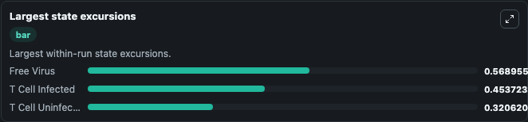

# Wodarz2007 - HIV/CD4 T-cell interaction Lab

Curated immunology lab using the bundled source model as the scientific source of truth.

## What You'll See

This captured run documents the default Wodarz2007 - HIV/CD4 T-cell interaction configuration for 10.0 time units with a 1.0 communication step. Default inputs include Initial T Cell Infected, Initial T Cell Uninfected, Initial Free Virus, and Uninfected T Cell Death Rate. Reported outputs include t_cell_infected, t_cell_uninfected, free_virus, and state. The screenshots below pair the run-interpretation table with Pathogen and immune response and Largest state excursions so the README shows both trajectories and the strongest state changes from the same dark-mode run.

<!-- BIOSIMULANT_VISUALS_START -->
### Output Visualizations

The run-interpretation table summarizes the configured Wodarz2007 - HIV/CD4 T-cell interaction simulation and its final-state diagnostics.

The Pathogen and immune response time series follows the selected immune, pathogen, tumor, or signaling quantities across the simulated horizon.

The largest state excursions chart ranks the state variables that moved furthest during the run.

<!-- BIOSIMULANT_VISUALS_END -->
