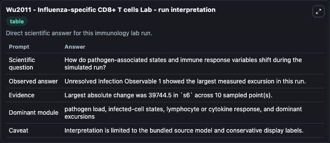
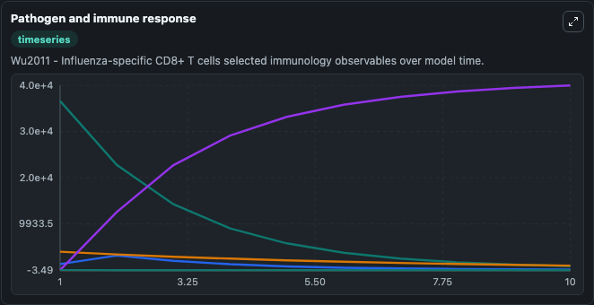
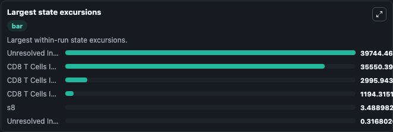

# Wu2011 - Influenza-specific CD8+ T cells Lab

Curated immunology lab using the bundled source model as the scientific source of truth.

## What You'll See

This captured run documents the default Wu2011 - Influenza-specific CD8+ T cells configuration for 10.0 time units with a 1.0 communication step. Default inputs include Initial CD8 T Cells In Spleen, Initial CD8 T Cells In Lung, Initial CD8 T Cells In Mln, and Initial Unresolved Infection Observable 1. Reported outputs include cd8_t_cells_in_spleen, cd8_t_cells_in_lung, cd8_t_cells_in_mln, and unresolved_infection_observable_1. The screenshots below pair the run-interpretation table with Pathogen and immune response and Largest state excursions so the README shows both trajectories and the strongest state changes from the same dark-mode run.

<!-- BIOSIMULANT_VISUALS_START -->
### Output Visualizations

The run-interpretation table summarizes the configured Wu2011 - Influenza-specific CD8+ T cells simulation and its final-state diagnostics.

The Pathogen and immune response time series follows the selected immune, pathogen, tumor, or signaling quantities across the simulated horizon.

The largest state excursions chart ranks the state variables that moved furthest during the run.

<!-- BIOSIMULANT_VISUALS_END -->
