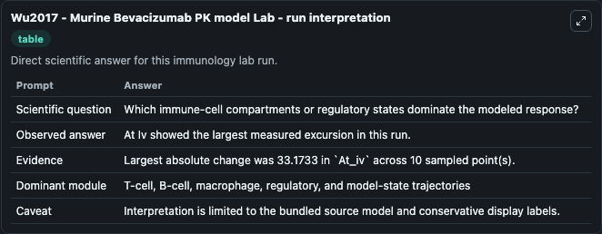
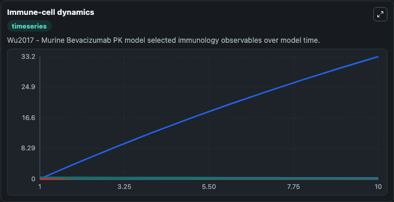
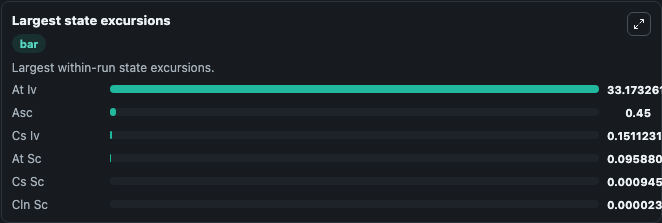

# Wu2017 - Murine Bevacizumab PK model Lab

Curated immunology lab using the bundled source model as the scientific source of truth.

## What You'll See

This captured run documents the default Wu2017 - Murine Bevacizumab PK model configuration for 10.0 time units with a 1.0 communication step. Default inputs include Dose Iv Parameter and Dose Sc Parameter. Reported outputs include cs_iv, at_iv, cs_sc, and at_sc. The screenshots below pair the run-interpretation table with Immune-cell dynamics and Largest state excursions so the README shows both trajectories and the strongest state changes from the same dark-mode run.

<!-- BIOSIMULANT_VISUALS_START -->
### Output Visualizations

The run-interpretation table summarizes the configured Wu2017 - Murine Bevacizumab PK model simulation and its final-state diagnostics.

The Immune-cell dynamics time series follows the selected immune, pathogen, tumor, or signaling quantities across the simulated horizon.

The largest state excursions chart ranks the state variables that moved furthest during the run.

<!-- BIOSIMULANT_VISUALS_END -->
