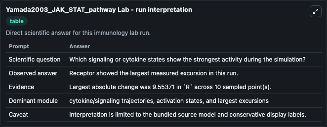
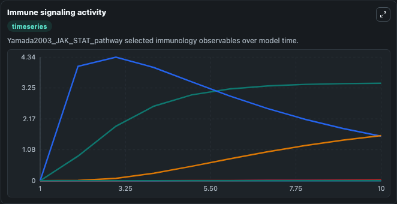
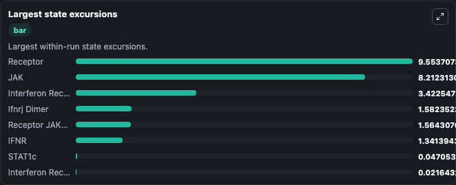

# Yamada2003 JAK STAT pathway Lab

Curated immunology lab using the bundled source model as the scientific source of truth.

## What You'll See

This captured run documents the default Yamada2003 JAK STAT pathway configuration for 10.0 time units with a 1.0 communication step. Default inputs include Initial Interferon Receptor JAK Complex, Initial Receptor JAK Complex, Initial Ifnrj Dimer, and Initial Activated Ifnrj Complex. Reported outputs include interferon_receptor_jak_complex, receptor_jak_complex, ifnrj_dimer, and activated_ifnrj_complex. The screenshots below pair the run-interpretation table with Immune signaling activity and Largest state excursions so the README shows both trajectories and the strongest state changes from the same dark-mode run.

<!-- BIOSIMULANT_VISUALS_START -->
### Output Visualizations

The run-interpretation table summarizes the configured Yamada2003 JAK STAT pathway simulation and its final-state diagnostics.

The Immune signaling activity time series follows the selected immune, pathogen, tumor, or signaling quantities across the simulated horizon.

The largest state excursions chart ranks the state variables that moved furthest during the run.

<!-- BIOSIMULANT_VISUALS_END -->
