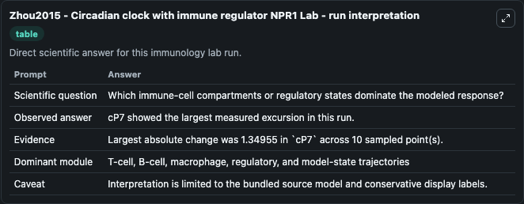
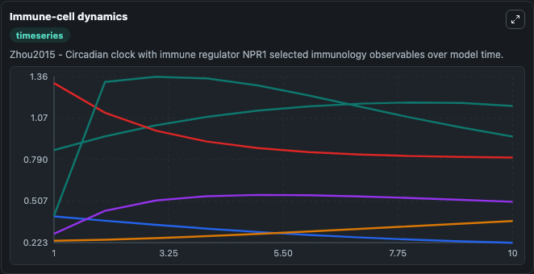
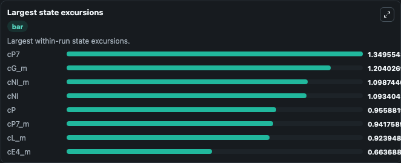

# Zhou2015 - Circadian clock with immune regulator NPR1 Lab

Curated immunology lab using the bundled source model as the scientific source of truth.

## What You'll See

This captured run documents the default Zhou2015 - Circadian clock with immune regulator NPR1 configuration for 10.0 time units with a 1.0 communication step. Default inputs include Initial Cabar M, Initial Unresolved Source Observable 2, Initial Unresolved Source Observable 3, and Initial Unresolved Source Observable 4. Reported outputs include cabar_m, unresolved_source_observable_2, unresolved_source_observable_3, and unresolved_source_observable_4. The screenshots below pair the run-interpretation table with Immune-cell dynamics and Largest state excursions so the README shows both trajectories and the strongest state changes from the same dark-mode run.

<!-- BIOSIMULANT_VISUALS_START -->
### Output Visualizations

The run-interpretation table summarizes the configured Zhou2015 - Circadian clock with immune regulator NPR1 simulation and its final-state diagnostics.

The Immune-cell dynamics time series follows the selected immune, pathogen, tumor, or signaling quantities across the simulated horizon.

The largest state excursions chart ranks the state variables that moved furthest during the run.

<!-- BIOSIMULANT_VISUALS_END -->
